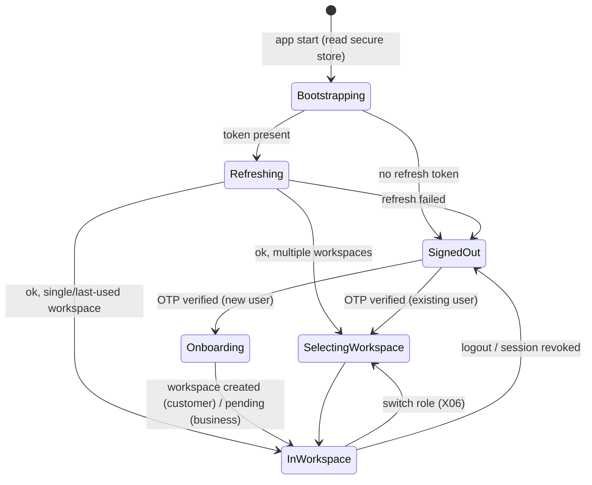

# Mobile App — Architecture

## 1. Project structure (`apps/mobile`)

```
apps/mobile/
├── app/                              # Expo Router routes (thin: compose feature screens)
│   ├── (auth)/ welcome, sign-in, verify, workspace, create-account, business-verification, terms, verification-status
│   ├── (customer)/(tabs)/ home, orders, marketplace?, messages, account     # tab set per D-24/UX decision
│   ├── (supplier)/(tabs)/ home, products, orders, receivables, account
│   ├── (provider)/(tabs)/ home, requests, operations, receivables, account
│   ├── (driver)/(tabs)/ jobs, messages, account
│   └── shared/ notifications, conversation/[id], document/[id], case/[id], settings/...
├── src/
│   ├── features/                     # one folder per module spec
│   │   ├── auth/  onboarding/  requests/  quotes/  orders/  tracking/
│   │   ├── shipping/  transport/  warehousing/  customs/
│   │   ├── marketplace/  supplier/  provider/  driver/
│   │   ├── payments/  cancellations/  cases/  insurance/
│   │   ├── documents/  messaging/  notifications/  account/
│   │   └── <feature>/ { screens/, components/, hooks/, api.ts, schemas.ts, analytics.ts }
│   ├── components/                   # design-system components (see 04-design-system.md)
│   ├── lib/  api/ (client, interceptors), realtime/, storage/, i18n/, money/, dates/, permissions/, upload/
│   ├── state/  session.store.ts, workspace.store.ts, drafts.store.ts
│   └── config/ env.ts, flags.ts
└── assets/  icons/ (from handoff), fonts/, images/, lottie/ (success states)
```

Rule: **feature folders never import each other's internals**. Shared UI lives in `components/`, and shared hooks and utilities in `lib/`.

## 2. Data layer

- The **API client** is generated from the backend OpenAPI spec (`@logix/api-client`). Request interceptors add:
  - `Authorization`
  - `X-Organization-Id`, `X-Workspace` (from `workspace.store`)
  - `Accept-Language`
  - `X-App-Version`, `X-Platform`
  - `Idempotency-Key` for mutations that need it (generated per user action and reused on retry)
- **TanStack Query** keys: `['orders', id]`, `['orders','feed', filters]`, `['requests', id, 'quotes', sort]`, and so on.
  - Default `staleTime` is 30 s (lists) / 10 s (detail). Refetch on focus and on realtime hints.
  - Reference data is cached for 24 h with ETag revalidation (`/reference/bundle`).
- **Mutations:** optimistic only for low-risk UI (favorites, mark notification read, chat send). Never optimistic for money or state transitions: show progress and wait for the server.
- **Error mapping:** API `error.code` → user message + recovery action (see [modules/13-shared-system-states.md](modules/13-shared-system-states.md)).

## 3. Session and workspace



- Tokens live in secure storage. The access token is also kept in memory. A single-flight refresh on 401 queues concurrent requests.
- The last used workspace is remembered. Switching workspace resets the query cache namespace and realtime rooms.
- The workspace status gates features. A business workspace with `PENDING_VERIFICATION` sees A08 status banners, and actions such as quoting, publishing and paying are disabled with an explanation.

## 4. Realtime
- One socket per session, connected when the app is in the foreground. Rooms are joined per visible screen (order detail joins `order:{id}`) plus `user:{id}` always.
- Events invalidate matching queries (for example `order.milestone` → invalidate `['orders', id]`). The tracking map consumes `tracking.location` directly for smooth marker animation.
- On background, the socket disconnects. Push handles alerts, and on resume the app refetches visible queries.

## 5. Offline and drafts (X08 "Offline — save draft and retry")
- Request forms, product listings, KYB forms and RC/POD inputs are persisted to MMKV **per step** in addition to the server draft, keyed by `draftId`.
- A connectivity banner shows when offline. Submits are disabled with "You're offline — your draft is saved".
- **Driver events and GPS** use an outbox queue (MMKV) with `eventId` and `occurredAt`. It flushes when online and the server deduplicates.
- Evidence photo uploads are resumable: a queued upload is retried with a new pre-signed URL if the old one expired.

## 6. Uploads
`lib/upload`:
1. Pick or scan (camera with edge detection for documents).
2. Compress and resize images (max 2560px, JPEG 0.8) and validate type and size (≤ 10 MB).
3. `POST /files/upload-url` → PUT to storage with a progress bar → `POST /files/{id}/complete`.
4. Poll or await `scan_status` → attach to the document or evidence.

Shared UI: upload dropzone, document row with status, retry on failure.

## 7. Payments
- `features/payments` wraps the gateway SDK: create the intent (server), present the SDK or 3DS web view, return, then **poll the intent status** (and listen for realtime) before showing success.
- The app never shows success on SDK callback alone (*"Payment success is shown only after gateway confirmation"*).
- Apple Pay button on iOS if supported by the gateway. mada is shown first for Saudi cards.

## 8. Permissions (device)

| Permission | When requested | Workspace |
|---|---|---|
| Notifications | After first meaningful action (e.g. request submitted), not on first launch | All |
| Camera | On first document scan / photo evidence | All |
| Photos | On first "choose from library" | All |
| Location (when in use) | Map pin picking (TR02, SH07, M07) | Customer |
| Location (always/background) | Starting the first trip, with an explanation screen | Driver |

## 9. Error handling and resilience
- Global error boundary per route group → friendly error screen + "Try again" + a Sentry event.
- Network retries are automatic for GET (3×, exponential). Mutations retry only when `retryable: true` and an idempotency key is present.
- Force update: `/app-config.minVersion` > current → blocking screen with a store link. Soft update notice for a recommended version.
- Kill switches from `/app-config.flags` hide or disable features (e.g. marketplace checkout) with a banner.

## 10. Security (MASVS L1)
- No secrets in the bundle (only public keys: maps SDK key restricted by bundle, gateway publishable key).
- Certificate pinning is optional (Phase 2), and the tradeoff is operational risk.
- Screens showing IBAN or full documents set `FLAG_SECURE` on Android (no screenshots) and blur in the iOS app switcher (proposal).
- Jailbreak/root detection is informational only (logged), and the app is not blocked.
- Logout clears secure storage, MMKV drafts (optional prompt) and the query cache.
