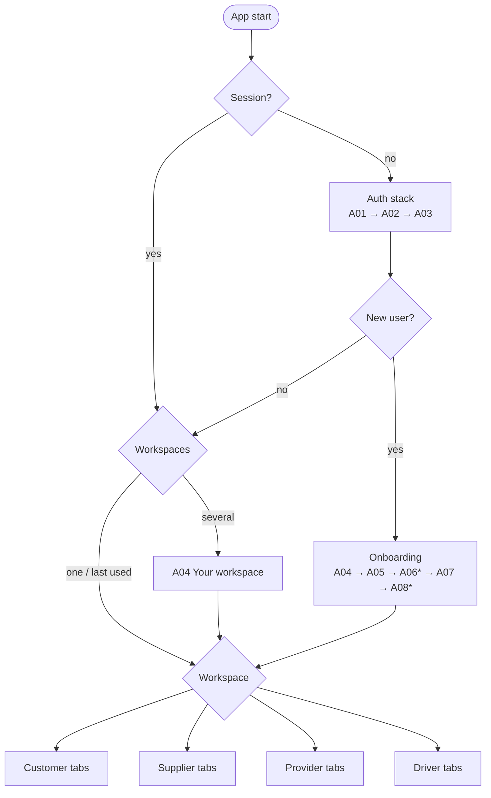

# Mobile App — Navigation and Workspaces

## 1. Top-level structure

`*` business accounts only.

## 2. Tab bars per workspace

The client PDFs disagree. V2 uses 4 customer tabs (Home, Orders, Messages, Account), while the Arabic kit uses 5 (Home, My orders, Marketplace, Messages, Account) and role-specific tabs for suppliers and providers. **Proposal (A-D01):**

| Workspace | Tabs (RTL order is mirrored automatically) | Icons (handoff names) |
|---|---|---|
| Customer | Home · My orders · Marketplace · Messages · Account | `home`, `orders`, `store`, `message`, `account` |
| Supplier | Home · Products · Orders · Receivables · Account | `home`, `package`, `orders`, `wallet`, `account` |
| Provider | Home · Requests · Operations · Receivables · Account | `home`, `document`, `truck`, `wallet`, `account` |
| Driver | Jobs · Messages · Account | `truck`, `message`, `account` |

The icons guide says *"Bottom bar uses account, message, orders and home"*, so the extra tabs reuse existing handoff icons (`store`, `package`, `wallet`, `truck`, `document`). No new icons are needed.

Tab badges: unread messages (Messages), items needing action (Orders: RC pending, documents needing correction; Requests: new matches; Jobs: new assignment).

## 3. Header pattern
- **Tab root screens:** logo centered, notification bell (with unread dot) on the start side, and the workspace switcher (organization name + chevron) on tap of the title area.
- **Inner screens:** back (`back-rtl` in Arabic, `back-ltr` in English), screen title and subtitle in the body (as in V2: *"Order follow-up — Sea • Shanghai to Jeddah"*), and an optional `more` menu (share reference, help, cancel…).
- V2 shows a dark navy header and the kit shows a white one. The final visual comes from Figma (D-24). Components support both via theme tokens.

## 4. Screen stacks

| Stack | Presentation | Screens |
|---|---|---|
| Request wizard (per service) | Full-screen modal stack with a stepper (e.g. "01/04") and "Save & exit" | SH01→SH07→SHR, TR01→TR04→TRR, WH01→WH02→WHR, CU01→CU04→CUR |
| Quotes | Push | SHQ/TRQ/WHQ/CUQ → quote detail (K-Q03) → compare (K-Q02) |
| Accept & pay | Push → payment sheet/WebView → result | SHP/TRP/WHP/CUP → K-B02 payment method → K-B03 confirmed / X07 |
| Order | Push from the Orders tab, Home or a notification | Follow-up (SHF…) → journey (SH08/TR06/CU08) → documents (SH09/CU07) → RC → DONE |
| Marketplace | Tab stack | M01 → M02 → M03 → M04 → M05 chat → M06 cart → M07 → M08 → M09 |
| Provider job | Push | P02 → P03 (quote) → P04 → service execution (PS/PT/PW/PC) → POD |
| Account | Tab stack | X06 settings → profile, addresses, organization, bank accounts, documents, team/drivers, language, sessions, terms, help |
| Global | Modal or push from anywhere | X05 notifications, conversation, case, document viewer, X07/X08 states |

## 5. Navigation rules
1. **Back preserves values** in wizards (client requirement), and the step state comes from the draft.
2. Leaving a wizard asks "Save as draft?" (default yes). Drafts are listed on Home ("Continue your request").
3. After payment success, the accept & pay stack is replaced by the order follow-up, so back doesn't return to payment.
4. Deep links to an entity in another workspace or organization prompt the user to switch ("This order belongs to Al Masar Transport (Provider). Switch?").
5. Destructive or financial actions (accept & pay, cancel, confirm receipt, submit quote, publish listing, approve release) use a confirmation bottom sheet summarizing the consequences.
6. `allowedActions` from the API decide which CTAs appear. Hidden actions are never rendered disabled without a reason. A disabled CTA always explains why (e.g. "Available after verification").

## 6. Deep links and push routing

Scheme `logix://` and universal links `https://app.logix.sa/…` (domain to confirm).

| Link | Destination | Workspace |
|---|---|---|
| `logix://orders/{id}` | Order follow-up (service-specific) | Customer / Provider (own) |
| `logix://requests/{id}/quotes` | Quotes list | Customer |
| `logix://purchase-orders/{id}` | M09 / S05 | Customer / Supplier |
| `logix://returns/{id}` | M11 / SR1 | Customer / Supplier |
| `logix://provider/opportunities/{requestId}` | P02 | Provider |
| `logix://driver/jobs/{id}` | PT2 | Driver |
| `logix://conversations/{id}` | Chat | Any participant |
| `logix://cases/{id}` | Case detail | Opener |
| `logix://settlements/{id}` | PAY1 / S08 | Provider / Supplier |
| `logix://verification` | A08 | Business owner |
| `logix://notifications` | X05 | Any |

Push payloads carry `{ deepLink, organizationId, workspace, notificationId }`. Tapping marks the notification read.

## 7. Home screens per workspace

| Workspace | Home content |
|---|---|
| Customer (H01) | Greeting (*Good morning, Ahmed — What do you need today?*), service tiles (Shipping, Transport, Warehousing, Customs clearance, B2B marketplace), hero CTA "Request a new service" (kit), stats (delivered / new offers / active requests; kit), recent activity cards (shipment on the way, pending offers), drafts to continue, CTA "View my orders" |
| Supplier (S01) | New orders count, active listings, net receivables, quick actions (add product, manage inventory), low-stock alerts |
| Provider (P01 / K-P05) | Banner "08 requests awaiting your offer", active jobs, receivables, filters (activity, city, date), links to fleet & licences and operations |
| Driver | Current job card (next stop, status CTA), upcoming jobs, completed today |
