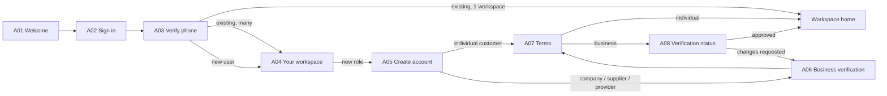

# App Module 01 — Access and Onboarding (A01–A08)

Backend: [auth-identity](../../../backend/md/modules/01-auth-identity.md), [organizations-kyb-terms](../../../backend/md/modules/02-organizations-kyb-terms.md).

## Flow

*"New users register; existing users enter their authorized workspace."*

## A01 — Welcome to Logix
- **Content:** title *Welcome to Logix*, subtitle *Your business, connected in one app*. Hero card *Logistics, made clearer — Request, compare and track in one place*. Service tiles: Shipping & transport (local and international), Storage & customs (specialist services), Business marketplace (products and verified suppliers). The kit variant uses a navy hero with plane → truck → ship line art and *"كل حركة، متصلة"*.
- **Actions:** `Sign in` (primary). Language toggle (top, ar/en).
- **Notes:** shown only when signed out. Tiles are informational (no navigation before sign-in).

## A02 — Sign in
- **Fields:** Mobile number (`+966` fixed prefix, input `5X XXX XXXX`, numeric keypad, LTR).
- **Content:** *One-time code — We will text you a verification code*. *New here? Create an account* (same flow: OTP first, then onboarding).
- **Validation:** Saudi mobile pattern `^5\d{8}$`. Inline error "Enter a valid Saudi mobile number".
- **Action:** `Send code` → `POST /auth/otp/request`. Button loading, and it is disabled during cooldown.
- **Errors:** `RATE_LIMITED` → "Too many attempts. Try again in mm:ss". `UPSTREAM_UNAVAILABLE` → X08 retry.

## A03 — Verify your phone
- **Fields:** 6-digit OTP (`OtpInput`, SMS autofill: iOS `oneTimeCode`, Android SMS Retriever with app hash).
- **Content:** *Resend code — Available in 00:45* (countdown). *Wrong number? Edit phone number* (back to A02 with the number prefilled).
- **Action:** `Verify & sign in` (auto-submit on the 6th digit) → `POST /auth/otp/verify` with device info + push token (if already granted).
- **Errors:** wrong code shows remaining attempts. Expired code → X08 *Expired verification code — Resend after cooldown*. Locked → back to A02.
- **Result routing:** see the flow above. Push permission is not requested here.

## A04 — Your workspace
- **Content:** *Choose the role you want to use*. Existing workspaces are listed first (org name, role, status badge: Active / Pending verification / Suspended). Then "Add a role": *Customer / buyer — Individuals or companies*, *Seller / supplier — Sell and manage products*, *Service provider — Freight, transport, storage, customs*.
- **Actions:** tap an existing workspace → its home (pending business workspaces open A08). Tap a new role → A05 with the role preset. `Open workspace` confirms.
- **Notes:** drivers never see "add role" options unless they also have their own org. Driver workspaces show as *"Driver • Al Masar Transport"*.

## A05 — Create an account
- **Fields:**

| Field | Rule |
|---|---|
| Account type | Segmented: Individual / Company (customer only; supplier and provider are always Company) |
| Full name | Required, 2–80 chars |
| Email | Optional for individuals, required for business, email format |
| Address | City + national address (short address or full fields) via the address sheet (G02); map pin optional |
| Business name / CR (kit) | Company only: legal name + CR number (10 digits) |
| Terms checkbox (kit) | Moved to A07 in V2. Don't duplicate |

- **Action:** `Save details` → `POST /organizations` + profile + address (one transactional endpoint or sequential with rollback).
- **Next:** individual customer → A07. Business → A06.

## A06 — Business verification
*For suppliers, providers and companies.*
- **Sections** (checklist from `GET /document-requirements?workspace=&activities=`):
  - Business name & registration: legal name, CR number, CR expiry, upload CR.
  - Activity licence: *based on the selected service*. Provider first selects activities (multi-select: sea/air/land freight, express, transport carrier, transport broker, warehouse, customs broker), and each activity adds its licence rows.
  - VAT ID & address: VAT number (15 digits, starts and ends with 3) if VAT-registered, VAT certificate, national address proof.
  - Business bank account: IBAN (`SA` + 22 digits, validated live) + bank proof upload. Account holder = legal name (warning if different).
  - Provider only: service areas per activity (cities/regions, lanes, checkpoints) (G06), which can be completed later but are required before quoting.
- **Upload UX:** DocumentRow per item with status. UploadZone for file or camera scan. Expiry date picker when the type has expiry.
- **Action:** `Submit for review` (enabled when required items are complete; otherwise the missing items are listed) → `POST /organizations/{id}/verification/submit`. It goes to A07 first if terms are not yet accepted.
- **Note:** *"Business verification is conditional. Providers submit licences relevant to their own activities."*

## A07 — Terms and consent
- **Content:** *Terms match the selected account role*. Summary cards per role:
  - Customer: *Accurate data, cancellation and receipt*
  - Seller: *3.5% commission and returns*
  - Service provider: *Freight / transport 10%; customs / storage 20%*
- **Consent:** checkbox *I agree to the terms*, with the link *Read full terms before accepting* (G25 full-text reader). **Never pre-checked.**
- **Action:** `Accept & continue` → `POST /consents { consentKey: TERMS_ACCEPTANCE, termsDocumentId }`. Supplier/provider variants also include the privacy policy consent.
- **Note:** the kit's supplier consent screen (K-S07) is covered here.

## A08 — Verification status
- **Content:** *We will notify you when your account is ready*. Items with status:
  - *Commercial registration — Accepted*
  - *Activity licence — A clearer copy is required*
  - *Replace document — Upload file and expiry date*
  - *Account status — Quoting and publishing after approval*

  Kit K-P04 timeline: *Business data submitted → Licence review (pending) → Request activation (after approval)*, plus "Update documents" and "Preview provider dashboard".
- **Actions:** per rejected item → replace (upload + expiry) → `Resubmit`. `Preview dashboard` opens the workspace in read-only mode with banners.
- **States:** `SUBMITTED`/`UNDER_REVIEW` (waiting illustration, SLA hint "usually within 1 business day"), `CHANGES_REQUESTED` (items highlighted), `APPROVED` (success → Open workspace), `REJECTED` (reason + contact support).
- **Realtime/push:** `verification.decided` refreshes the screen.

## Analytics
`sign_in_started`, `otp_verified`, `otp_failed{reason}`, `workspace_selected`, `onboarding_step_completed{step}`, `verification_submitted`, `verification_resubmitted`.

## Acceptance criteria
- [ ] A new individual customer reaches H01 in ≤ 5 screens.
- [ ] OTP autofill works on iOS and Android. The resend timer and lockouts match the backend rules.
- [ ] The business checklist adapts to the selected activities, and resubmission keeps accepted items.
- [ ] Terms checkboxes are never pre-checked, and consent is recorded with the version.
- [ ] Every screen works in RTL and LTR.
