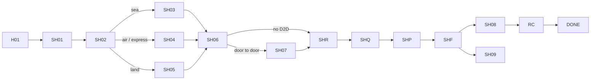

# App Module 03 — Shipping (SH01–SH09)

Shared parts (wizard frame, review, quotes, accept & pay, follow-up, RC, DONE) are in [module 02](02-customer-home-orders-completion.md). Backend: [shipping-freight](../../../backend/md/modules/07-shipping-freight.md).

## Flow

*"From SH01: sea to SH03, air/express to SH04, land to SH05."* *"SH04 and SH05 are alternatives; Door to Door opens SH07 before review."* (The route step comes before cargo, as in V2.)

## SH01 — How are you shipping?
*Choose a shipping mode and service.*

| Field | Type | Values / rule |
|---|---|---|
| Shipping mode | Segmented | Sea / Air / Land |
| Express shipping | Toggle row | *Priority service with quoted delivery time*. Enabled for Air (and land if providers support express, config) |
| Door to door | Toggle row | *Pickup and delivery at your addresses* |
| Trade direction | Segmented | Import / Export |

- **CTA:** `Set route`.
- A help link explains Shipping-land vs Transport (D-13): *"Need a dedicated truck? Use Transport."*
- Changing mode after later steps are filled shows a confirmation that incompatible cargo fields will be cleared.

## SH02 — Origin and destination
*Example sea freight route.*
- Map card (illustrative route line until both points are set).
- Fields by mode:
  - **Sea:** Departure port (search ports: *Shanghai, China* / CNSHA), Arrival port (*Jeddah Islamic Port* / SAJED).
  - **Air/express:** origin and destination airport (DXB, RUH).
  - **Land:** handled in SH05 (country + city).
- *Cargo ready date* (date picker, ≥ today, e.g. 28/09/2026).
- *Other — Add a port or special requirement* (free text; "port not listed" also lets the user type a port name).
- **Validation:** import → destination in Saudi Arabia, export → origin in Saudi Arabia (soft rule, confirm), origin ≠ destination.
- **CTA:** `Cargo details`.

## SH03 — Sea freight cargo
*Set commodity and container capacity.*

| Field | Rule |
|---|---|
| Commodity | Picker (*Packaging materials / other*), "other" → text |
| Container type | Dry / Refrigerated / Other (reefer → temperature field) |
| Size | 20 ft / 40 ft / LCL |
| Quantity & weight | FCL: containers count ≥ 1 + total weight (kg/t), e.g. *1 container • 8 tonnes* |
| LCL details | Shown only for LCL: *volume in cubic metres and package count* |
| HS code (kit F02) | Optional, 6–12 digits |
| Goods description (kit) | Optional |

**CTA:** `Add services`.

## SH04 — Air or express cargo
*Details for air freight and parcels.*
- Origin & destination (*Dubai DXB / Riyadh RUH*), commodity (*Office equipment / other*), weight & packages (*360 kg • 12 packages*), dimensions per package (*Length × width × height*, a repeater, or "all packages same size"), other (*Handling or priority requirements*).
- Chargeable weight hint: "Chargeable weight ≈ X kg (volumetric)". Informational only.
- **CTA:** `Save cargo details`.

## SH05 — International land freight
*Set your cross-border shipment route.*
- Origin country & city (*Riyadh, Saudi Arabia*), destination country & city (*Dubai, UAE*), commodity, quantity & weight (*20 pallets • 8 tonnes*), other (*Border and handling instructions*).
- **CTA:** `Add services`.

## SH06 — Additional services
*Tailor the service to your needs.*
- ☐ *Door to door — Set pickup and delivery addresses*
- ☐ *Customs clearance — Link a customs request to this shipment* (creates the linked request after award, G22)
- ☐ *Cargo insurance — Compare insurers and coverage* (the IN1 flow opens after award)
- *Other — Describe your requirements*
- Kit F03 also has: ☐ urgent shipping priority, ☐ temporary storage, and an info card *"Transparent cost — each add-on's cost appears in the provider's offer before confirmation"*.
- **CTA:** `Review request` (or → SH07 when D2D is checked).

## SH07 — Door-to-door details
*Addresses and contacts.*
- Pickup address (*Warehouse and gate number*): address sheet (G02).
- Delivery address (*National address and map pin*).
- Contacts: sender and recipient name + phone.
- Pickup window (*09:00 – 12:00*): time range picker.
- Other (*Access, loading and unloading*).
- **CTA:** `Save addresses` → SHR.

## SHR / SHQ / SHP / SHF
Shared screens with shipping data:
- SHR subtitle *Sea • Shanghai to Jeddah*. Summary: mode, route, cargo, services, D2D.
- SHQ example: *Al Masar • 4.8 — 13,800 SAR; Al Ofoq • 4.6 — different timeline and terms*.
- SHP example: *Service fee 12,000 • VAT 1,800 • Total 13,800 SAR*.
- SHF: shared follow-up. It shows linked customs and insurance rows when present.
- Kit F04 review adds *"What happens after sending? Qualified service providers will receive your request to submit offers you can compare"* and a combined accuracy/no-hazardous-materials checkbox.

## SH08 — Shipment journey
*LX-2048 • sea • updated 2 minutes ago.*
- Timeline milestones: *Picked up — Cargo receipt recorded*, *Departed — Departure confirmed*, *Estimated arrival — 05/10/2026*, *Clearance & delivery — Awaiting arrival* (accent = current).
- Each item shows the timestamp and source label (Provider/Integration/Admin) in a small caption.
- Road legs (D2D or land) with GPS show a "View live map" link to the tracking map (the TR05 component). *"Sea and air use journey milestones; vehicle maps apply to road legs when data is available."*
- **CTA:** `View documents` → SH09.

## SH09 — Shipment documents
*All shipment files in one place.*
- DocumentRows:
  - *Bill of lading — Accepted • view file*
  - *Invoice & packing list — Uploaded*
  - *Origin & SABER certificates — As applicable to the shipment*
  - *Other — Add and name a document*
- Tap → document viewer (versions, status, rejection reason). Replace when changes are requested.
- **CTA:** `Upload document` → type picker (or "Other" + name) → UploadZone.
- Provider-uploaded references (B/L number, container and seal numbers, AWB) appear in a "Shipment references" card.

## RC / DONE
Shared. RC applies to D2D deliveries. For port-to-port, the completion step is the provider's arrival/release evidence with customer confirmation (same RC screen, with condition options adapted to "documents received").

## Edge cases
- The quote validity ends while the customer is on SHP → X07 *Expired quote*.
- Linked customs is requested but the shipping order is cancelled → the linked draft is cancelled too, with a notice.
- The insurance option is offered only before departure.

## Acceptance criteria
- [ ] Mode routing (SH03/SH04/SH05) and D2D routing (SH07) match the spec, and back navigation keeps values.
- [ ] Ports search in Arabic and English, and codes display LTR-isolated.
- [ ] SH08 shows source and time for every milestone, and SH09 supports replace-on-rejection.
