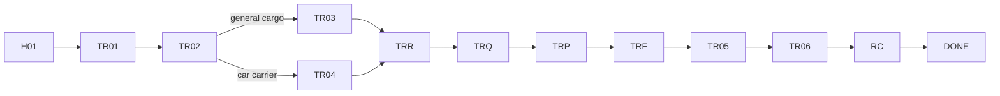

# App Module 04 — Transport (TR01–TR06)

Shared parts are in [module 02](02-customer-home-orders-completion.md). Backend: [transport-fleet](../../../backend/md/modules/08-transport-fleet.md). The kit's transport wizard (K-L01–K-L04) is merged here, and it is the *"core example: domestic road transport"* in the Main Screens PDF.

## Flow

*"TR03 is general cargo; car carriers use TR04 instead of commodity and weight fields."*

## TR01 — New transport request
*Within Saudi Arabia or abroad.*

| Field | Type | Values |
|---|---|---|
| Transport scope | Segmented | Domestic / Cross-border |
| Vehicle type | Picker with icons | Dry / reefer / light truck / lowbed, and more: curtain-side / car carrier / flatbed / trailer / other. The kit L02 uses a segmented control: Trailer · Refrigerated · Curtain-side, plus a selected card *"Trailer / heavy flatbed — suitable for industrial and large loads"* |
| Other | Text | *Describe the required vehicle* (required when "other") |

- Cross-border adds destination country selection (on TR02).
- **CTA:** `Set route`.

## TR02 — Pickup and drop-off
*Pin both locations on the map.*
- Map card with two pins + route line. The kit adds *"Illustrative map • Jeddah → Riyadh"* and *"Use my current location"*.
- Pickup location (*Riyadh Industrial City*) and drop-off location (*Jeddah warehouses*), each via search (places autocomplete through the backend proxy), pin drop, or saved address.
- Contact person: *name and phone at each stop*.
- Transport date (*28/09/2026*) + optional time window (kit L03: loading date *10/14/2026*, loading time *09:00 AM*).
- Route estimate card (kit L01): *"950 km • ~10 hours — illustrative distance and time; values update after route is set"*.
- **CTA:** `Load details`.

## TR03 — Load details (general cargo)
*For all vehicle types except car carriers.*

| Field | Rule |
|---|---|
| Commodity | Picker (*Packaging materials / other*); kit: goods classification dropdown (e.g. *Equipment*) |
| Weight & unit | Number + kg/ton segmented (kit L02: *18* + ton) |
| Required quantity | Number + unit (*20 pallets*; kit: *number of pallets/units 24*) |
| Temperature | Reefer only (kit: *"temperature • refrigerated only"*, e.g. 4 °C) |
| Loading & unloading | *Assistance / forklift / none* |
| Extras (kit L03) | ☐ Loading and unloading assistance, ☐ Temporary storage / cross-docking, handling instructions (e.g. *"Forklift available at loading site"*) |
| Other | *Temperature or special handling* |

- Kit L03 info card *"How is the cost calculated? Inside the city: priced by area and vehicle. Between cities: distance, load and add-ons. The final price is in the offer."*
- Weight above typical vehicle capacity shows a warning ("may require a larger vehicle"). It does not block.
- **CTA:** `Review transport request`.

## TR04 — Car carrier request
*Dedicated car carrier flow.*
- Pickup location (*Riyadh*), drop-off location (*Jeddah*), number of vehicles (*6*), date (*28/09/2026*), other (*vehicle and delivery notes*: make/model optional).
- **CTA:** `Review transport request`.

## TRR / TRQ / TRP / TRF
- TRR: subtitle *Riyadh to Jeddah • trailer*. The kit L04 review shows *Jeddah → Riyadh • trailer • 18 t • 24 pallets*, appointment *14 Oct • 09:00*, illustrative distance *950 km*, selected services, accuracy checkbox, `Edit request`, CTA `Request price offers`.
- TRQ: *Al Masar • 4.8 — 2,760 SAR*. Kit Q01 cards: *Al Masar carrier 2,760 SAR • 4.8 ★ • ~86 trips • delivery within a day*; *Al Ofoq solutions 2,875*; *Fast supply 3,105*.
- TRP: *Service fee 2,400 • VAT 360 • Total 2,760 SAR*.
- TRF: shared follow-up with the assignment card once a driver is assigned (*Driver & vehicle: Mohammed • truck 4821*).

## TR05 — Your vehicle is on the way
*LX-3081 • transport.*
- Live map: route polyline, pickup/drop-off pins, and a vehicle marker animated from `tracking.location` events.
- Rows:
  - *Driver & vehicle — Mohammed • truck 4821*
  - *Current location — Updated one minute ago* (relative time from the last point; stale > 10 min → amber "Location not updated since 10:12")
  - *Pickup arrival — Expected 10:30* (ETA from the server)
  - *Current stage — Driver heading to pickup*
- Kit T01: *Expected arrival 06:30 PM — "demo location, not a live prediction"* disclaimer (remove when live, A-D08).
- **CTA:** `Message driver` → order conversation with the driver participant (no phone number exposed, A-D10).
- The map is only interactive when a live trip exists. Otherwise it shows the planned route.

## TR06 — Trip progress
*Track from loading to unloading.*
- Timeline:
  - *Arrived at pickup — Arrival recorded*
  - *Cargo collected — Photos and unit count* (tap → evidence photos)
  - *In transit — Destination: Jeddah*
  - *Delivery — Awaiting driver proof and buyer acceptance*
- Cross-border adds *Border crossing — international trips only* + border documents. *"Cross-border jobs add a border-crossing stage and required documents before delivery."*
- Trip issues reported by the driver (delay, access) appear inline as amber notices with the reason and time.
- **CTA:** `Delivery details` → proof of delivery view (POD photos, signature, recipient, time) → `Confirm receipt` (RC).

## RC / DONE
Shared ([module 02](02-customer-home-orders-completion.md)). Transport RC defaults: unit count = the quantity collected (from `CARGO_COLLECTED`), editable.

## Edge cases
- The vehicle is reassigned before collection → a banner "Your driver changed", and the assignment card updates.
- GPS permission is denied on the driver side → TR05 shows milestones only, with "Live location unavailable".
- A customer cancels while the driver is heading to pickup → the X02 preview shows the 10% stage (per the rules), then 25% after arrival.

## Acceptance criteria
- [ ] The car carrier path replaces the commodity/weight step, and reefer requires a temperature.
- [ ] Map pin picking works with search, current location and saved addresses. The route estimate displays with the "estimate" wording.
- [ ] The live map updates smoothly (p95 < 5 s from ingest), and the stale state appears correctly.
- [ ] The cross-border stage appears only for cross-border trips.
