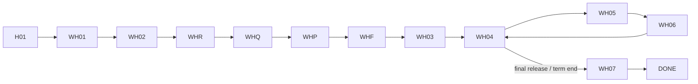

# App Module 05 — Warehousing (WH01–WH07)

Shared parts are in [module 02](02-customer-home-orders-completion.md). Backend: [warehousing](../../../backend/md/modules/09-warehousing.md).

## Flow

*"The warehousing quote board connects WH02 to intake booking WH03."* *"Partial release returns to inventory; final closure requires no remaining stock."*

## WH01 — Book warehouse space
*Choose location and storage conditions.*

| Field | Rule |
|---|---|
| City | Picker (*Riyadh*; kit W01: *Jeddah*) |
| Storage type | *Dry / chilled / frozen / other* (kit: segmented Dry · Chilled · Frozen) |
| Start and end dates | Range picker (*01/10 – 30/10/2026*). End > start. The duration in days is shown |
| Space or capacity | Number + unit: *pallet spaces / square metres* (*20 pallet spaces*) |
| Kit extras | Unit count (*24 pallets*), storage requirements text, ☐ *I need transport to the warehouse* |

**CTA:** `Inventory details`.

## WH02 — Goods and handling
*Help the warehouse quote accurately.*

| Field | Rule |
|---|---|
| Commodity | Picker + other |
| Quantity & weight | *20 pallets • 8 tonnes* |
| Temperature | *Shown for temperature-controlled storage*: required range for chilled/frozen |
| Handling services | Multi-select chips: *Receiving / loading / sorting* (+ labeling, palletizing, other) |
| Other | *Special requirements or documents* |

**CTA:** `Review storage request`.

## WHR / WHQ / WHP / WHF
- WHR subtitle *20 pallets • 30 days*. The kit W02 review shows *Dry storage • Jeddah — 24 pallets • 14 Oct → 14 Nov*, the service conditions note *"Receipt, stock condition, entry and exit appointments. Handling fees and any minimum period appear in the provider's offer"*, and the accuracy checkbox.
- WHQ: *Al Masar • 4.8 — 3,450 SAR*.
- WHP: *Service fee 3,000 • VAT 450 • Total 3,450 SAR* (billing per D-12).
- WHF: shared follow-up. `nextAction = BOOK_INTAKE_SLOT` highlights WH03.
- *"Q01 and B01 show reusable layout references with road-transport sample content. Production must bind them to the storage request, price and cancellation milestones."* (kit note). Use storage copy and fields on these shared screens.

## WH03 — Warehouse intake booking
*After accepting the storage quote.*
- Warehouse: *Al Masar • Riyadh* (site name, address, map link, working hours).
- Receiving slot: choose one of the provider's proposed slots (*01/10/2026 • 10:00*). "Request another time" sends a message to the provider.
- Expected quantity: *20 pallets* (editable before confirmation, with a warning if different from the booking).
- Transport to warehouse: *Linked transport / self-delivery*. Linked opens the transport wizard prefilled (G22) with the drop-off = warehouse.
- **CTA:** `Confirm intake slot`.

## WH04 — Your stored inventory
*WH-105 • updated today.*
- Hero tile: *Received — 20 pallets*.
- Rows: *Available — 18 pallets*, *Reserved for release — 2 pallets*, *Stock condition — Intact • view intake photos* (gallery of intake evidence, discrepancy notes if any).
- Item list (when several items): description, location (*A-04*), quantity.
- Movements history (intake/release/adjustment with dates and evidence).
- Contract card: dates, days remaining, a term-end reminder ("Ends in 7 days — extend or release").
- **CTA:** `Request stock release` → WH05.

## WH05 — Request stock release
*Choose quantities and release date.*

| Field | Rule |
|---|---|
| Item | Picker (*Packaging materials*) |
| Quantity | Stepper, **max = available** (*2 pallets of 18 available*) |
| Release date | Date ≥ today (*15/10/2026*) |
| Collection method | *Linked carrier / self-collection*. Linked → prefilled transport request. Self → collector name + ID/phone |
| Other | *Release and handover instructions* |

**CTA:** `Submit release request` → release reference (e.g. *WH-105-R2* / `LX-…-R2`).

## WH06 — Release progress
*WH-105-R2 • partial release.*
- Timeline:
  - *Request reviewed — Approved*
  - *Pick and prepare — In preparation*
  - *Carrier handover — Awaiting pickup*
  - *Expected stock balance — 16 available pallets after release* (accent)
- Handover evidence appears when done (photos, collector, time).
- **CTA:** `Confirm released stock` (the customer confirms receipt of the released goods, lightweight RC for releases). Linked transport shows its own tracking.
- Cancel is allowed before picking.

## WH07 — Storage reconciliation
*At term end or after full stock release.*
- *Storage period — 30 days*
- *Agreed charges — 3,450 SAR*
- *Additional services — Require approval before charging* (list with approve/reject if pending, G21)
- *Remaining stock — Zero for full closure* (a non-zero value blocks closure and shows "Release remaining stock or extend")
- **CTA:** `View invoice` / `Accept reconciliation` → DONE (rating, invoice, case, reuse request). A dispute option opens a case.

## Edge cases
- Intake discrepancy (actual 19 vs expected 20) → a banner on WH04 asking the customer to acknowledge, with photos. Acknowledge or open a case.
- Overstay after the end date → a banner with extension options (charges require approval, D-12).
- Concurrent release requests exceeding available stock → server `409 STOCK_INSUFFICIENT` → inline error with the refreshed availability.

## Acceptance criteria
- [ ] Inventory numbers on WH04 always equal the server balances, and reserved quantities are shown separately.
- [ ] The release quantity cannot exceed available stock, and the reference follows `-R{n}`.
- [ ] WH07 blocks closure while stock remains, and additional charges need explicit approval.
