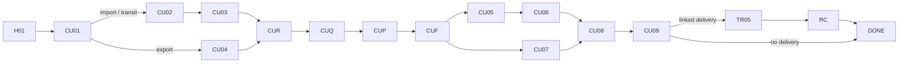

# App Module 06 — Customs Clearance (CU01–CU09)

Shared parts are in [module 02](02-customer-home-orders-completion.md). Backend: [customs](../../../backend/md/modules/10-customs.md), [files-documents](../../../backend/md/modules/04-files-documents.md).

## Flow

*"Import/transit use CU02 and CU03; export uses CU04. Final requirements depend on the shipment."*

## CU01 — Customs clearance request
*Choose movement type and checkpoint.*

| Field | Rule |
|---|---|
| Movement type | Segmented: Import / Export / Transit |
| Checkpoint type | *Sea / air / land / dry port* |
| Checkpoint | Picker filtered by type (*Jeddah Islamic Port / other*) |
| Cargo type & quantity | *Dry container • 1* (type picker + count) |
| Kit D01 extras | Bill of lading number (*BL-2026-08412*), HS code, goods description |
| Other | *Additional requirements* |

**CTA:** `Add shipment details`.

## CU02 — Import and transit details
*Fields adapt to the selected movement.*
- Arrival port (*Jeddah Islamic Port*), shipment quantity (*1 container*).
- Transit only: transit destination (*shown only for transit*), exit checkpoint (*required in the transit request*).
- Other (*Customs movement notes*).
- **CTA:** `Upload documents`.

## CU03 — Import / transit documents
*Upload or scan documents.*
- Checklist (DocumentRows):
  - *Bill of lading — Uploaded*
  - *Commercial invoice — Uploaded*
  - *Packing list — Uploaded*
  - *Certificate of origin — Add file*
  - *SABER certificate — As applicable to the product* (info icon explaining SABER/SASO conformity)
  - *Other — Document name + attachment*
- UploadZone per item: file or camera scan (edge detection → K-D03 editor). *"PDF, JPG, PNG • max 10 MB"*.
- Missing required documents don't block submission (the broker can request them later), but CUR shows a warning.
- **CTA:** `Review documents`.

## CU04 — Export documents
*Departure port and shipment quantity.*
- Departure port (*Jeddah port • 1 container*), booking confirmation (attach), commercial invoice (attach), certificate of origin (attach), other (*name and attach another document*).
- **CTA:** `Review request`.

## CUR / CUQ / CUP / CUF
- CUR subtitle *Import • Jeddah port*.
- CUQ: brokers only (*Al Masar • 4.8 — 1,150 SAR*).
- CUP: *Service fee 1,000 • VAT 150 • Total 1,150 SAR*. **Info note:** duties and government charges are paid separately and are not part of the broker fee.
- CUF: `nextAction = CREATE_BROKER_AUTHORIZATION` right after payment.

## CU05 — Create broker authorization
*Review broker details and authorization scope.*
- *Selected broker — Al Masar Customs • licence* (tap → broker profile with licence info)
- *Authorizing business — Legal name and registration* (from KYB, read-only)
- *Scope and validity — Order LX-2048 • defined validity*
- Consent: *☐ I approve this authorization — Creates a request; not yet an active mandate*
- **CTA:** `Create authorization request`.
- Individual customers without the needed identity data are asked for a national ID/Iqama (D-17).

## CU06 — Authorization status
*Track activation and official reference.*
- Timeline:
  - *Request created — Details saved*
  - *External action — Complete official action if required* (with a help sheet explaining the official step, if the broker flagged it)
  - *Authorization reference — Awaiting confirmation*
  - *Status — Inactive until an authorized confirmation* (accent)
- Each row shows the source and time ("Updated by broker • 14 Oct 10:20"). *"An in-app authorization request is not proof of Fasah activation. Show status and update source clearly."*
- **CTA:** `Refresh authorization` → `POST …/refresh` (pull-to-refresh too).
- The active state shows a green "Active • Ref XXXX • valid until …".

## CU07 — Document review
*Resolve requests so the broker can proceed.*
- Per document, the broker decision:
  - *Commercial invoice — Accepted*
  - *Certificate of origin — A clear stamp image is required* (rejection reason)
  - *SABER certificate — Under review where applicable*
  - *Other — Add a broker-requested document*
- **CTA:** `Replace certificate` (context-aware: "Replace <document>") → DocumentCorrection (K-D03): shows the reason, a preview, *crop edges / rotate / enhance clarity* tools, and "Choose a clearer copy" → `Send for review`.
- Kit D02 vault: status badges *Accepted / Under review / Rejected*, file name and size (*BL-2026.pdf • 1.2 MB*), and *Scan and enhance document*.
- *"Correction is conditional: rejected documents open D03, then return to D02."*

## CU08 — Clearance progress
*Last update • broker entry.*
- Timeline:
  - *Customs declaration — Sample reference CU-2048* (the actual reference once entered)
  - *Document review — Completed*
  - *Inspection and duties — In progress • separate from broker fees*
  - *Release — Awaiting confirmation*
- Kit D04 adds the banner *"Action required: re-upload the packing list"*, a *Document centre (1 accepted / 1 under review / 1 rejected)* card, and *Contact the broker (via the request conversation)*.
- Source and time on every status.
- **CTA:** `View status details` (expanded view with history per status and the evidence the broker attached).

## CU09 — Customs released
*Your shipment is ready for the next step.*
- Success check.
- *Release notice — View and download document*.
- *Charges — Broker fees and duties itemized separately* (a breakdown sheet: broker fee paid via Logix; duties paid by customer/broker with receipt).
- *Port collection — Link transport or select a carrier* → transport wizard prefilled: pickup = port, drop-off = the customer's default address (G22).
- *Confirmation — Confirm clearance completion*.
- **CTA:** `Confirm clearance completion` → DONE. When a linked transport exists, it continues with TR05 → RC → DONE for the delivery order.
- *"CU09 completes customs work; transport and receipt appear only for a linked delivery order."*

## Edge cases
- The broker tries to proceed without an active mandate: the server blocks it. The customer sees "Waiting for authorization activation" on CU08.
- Documents expired or rejected repeatedly: the broker can open a document-issue case.
- The customs request was linked from a shipment (SH06): CU01–CU02 are prefilled from the shipment, and the customer only confirms and uploads documents.

## Acceptance criteria
- [ ] Fields and document checklists adapt to import, export and transit.
- [ ] Rejected documents show reasons, and the correction tool produces a replaced version that returns to review.
- [ ] Authorization and clearance statuses always display source and timestamp.
- [ ] Duties are never shown as part of the Logix payment total.
