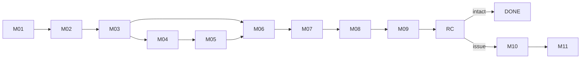

# App Module 07 — Marketplace, Buyer Side (M01–M11)

Backend: [marketplace](../../../backend/md/modules/11-marketplace.md). Supplier side: [module 08](08-supplier.md).

## Flow

*"Classifieds-style discovery in Logix branding, with B2B purchasing and payment kept in-app."*

## M01 — Business marketplace (tab root)
*Find business supplies near you.*
- Search bar *Search products or suppliers*, quick chips *Riyadh • Equipment • Packaging • Other* (city + categories).
- Kit M01: category segmented control (*All / Packaging materials / Equipment / Building materials*) and a hero *"Easier supply — every need has a supplier"*.
- Product grid (2 columns): image (supplier photo; illustration fallback), favorite heart (accent), name, price (*Shipping cartons 12 SAR*, *Warehouse shelving 850 SAR*, *Shipping pallets 65 SAR*, *Handling equipment 420 SAR*).
- Kit list rows: *"Carton packaging boxes — 12 SAR/piece • min 100"*, *"Industrial storage pallets — 85 SAR/piece • min 20"*, *"Compare suppliers — review prices, minimums and lead time"*.
- **CTA:** `Explore products` → M02 (all).

## M02 — Search results
*Packaging • 128 illustrative results.*
- Filters (sheet):
  - Location (*Riyadh / Jeddah / all cities*)
  - Price range (*100 – 5,000 SAR*)
  - MOQ & availability (*In stock • 100 units*)
  - Sort by (*Newest / price / verified supplier*)
- **CTA:** `Apply filters`. The result list uses infinite scroll.
- Empty results: X08 *No results — Adjust filters or create a request*.

## M03 — Product details
*Reinforced shipping cartons — Packaging Factory • Riyadh • verified.*
- Image gallery (swipe, zoom), "Illustrative product image" caption on placeholders.
- *Unit price — 12 SAR*, *Minimum order — 100 units*, *Available stock — 5,000 units*, *Specifications & origin — 5-ply • made in Saudi Arabia* (kit: *reinforced carton • 40×30×30 cm • origin Saudi Arabia*), an availability badge (*In stock*).
- Quantity stepper (min = MOQ, step = pack size if set).
- Links: supplier profile (M04), *Message supplier* (M05), favorite.
- **CTA:** `Add to cart` → toast + cart badge. If the cart has another supplier's items, the prompt says "Your cart has items from another supplier. Checkout is per supplier" (v1).

## M04 — Supplier profile
*Packaging Factory • rated 4.8 / 5.*
- *Verification — Business details verified* (badge), *Location — Riyadh Industrial City*, *Supply terms — MOQ 100 • ready in 2 days*, *Contact — In-app chat and specification sharing*.
- Supplier's products list, ratings summary, legal disclosure (CR, VAT number; e-commerce requirement).
- **CTA:** `Message supplier` → M05.

## M05 — Supplier conversation
*Keep order discussions on the platform.*
- Chat thread (you/supplier bubbles): *"Are 100 units available in this size?" — "Yes, ready within two business days."*
- Attach *Product specification — Attach an image or file*.
- Info row *Review purchase — Final agreed prices appear in the order*.
- Masked contact details before the first paid PO (a hint is shown to the sender).
- **CTA:** `View item & quantity` → M03 or M06.

## M06 — Your cart
*Order from Packaging Factory.*
- Line: image, *Reinforced shipping cartons — 100 × 12 SAR*, *Product subtotal — 1,200 SAR*, *Change quantity — Minimum 100 units* (stepper, blocks below MOQ and above stock).
- *Saved items — Save for later or remove*.
- Kit M03: *Product value 1,200 SAR • Shipping — determined in the next step • Minimum order: 100 pieces; the order can't be completed with a lower quantity.*
- Price-changed warning if a listing price changed since it was added.
- **CTA:** `Checkout` → M07.

## M07 — Delivery and payment
*Review the total before placing your order.*
- *Delivery address — Riyadh • national address* (address sheet).
- Shipping method (D-15): *Shipping via Logix* / supplier delivery / pickup.
- Breakdown (kit M04): products 1,200.00, shipping 200.00, additional fees 0.00, customs (not applicable for local) 0.00, illustrative VAT 210.00, financing cost 0.00, **total 1,610.00 SAR**.
- *Payment method — Card / Mada / eligible business finance* (finance only if eligible).
- Consent *☐ I accept purchase terms — View return policy*.
- **CTA:** `Pay & place order` → `POST /checkout` (with the checkout quote id) → payment → M08.
- *"The same order total persists through checkout."* If the checkout quote expired (15 min), re-quote and show changes before paying.

## M08 — Purchase confirmed
*PO-1048 • Packaging Factory.*
- Success check. *Payment — Confirmed • 1,610 SAR*, *Preparation — Within two business days*, *Delivery — After supplier readiness*, *Order follow-up — Preparation, pickup and delivery*.
- Kit M05: *"Next step: the supplier prepares the goods, then pickup and transport are coordinated"*, status *In preparation*.
- **CTA:** `Track purchase` → M09.

## M09 — Purchase tracking
*PO-1048 • estimated delivery 30 September.*
- Timeline:
  - *Supplier confirmed — Order accepted*
  - *Ready for pickup — Preparing and packing*
  - *Shipping — Carrier reference appears after assignment* (tap → the linked transport tracking TR05 when available)
  - *Delivery — Customer acceptance after inspection*
- Kit M06 cards: *product details (100 packaging boxes)*, *message the supplier (conversation linked to the order)*, *Request return* (outline, shown after delivery within the window), CTA *View linked shipment*.
- **CTA:** `View delivery details` → POD evidence → RC.

## RC (purchase)
Shared RC ([module 02](02-customer-home-orders-completion.md)). *"After RC: intact goods proceed to rating; issues open M10. The 24-hour damage report differs from the return window."*

## M10 — Return or replacement
*Select items and describe the issue.*

| Field | Rule |
|---|---|
| Reason | *Defect / pre-delivery damage / mismatch* |
| Quantity | ≤ received (*10 units*) |
| Evidence | *Photos and issue description* (photos required) |
| Preferred resolution | *Replacement / refund* |
| Displayed window | *3 days after receipt under supplied policy* (countdown; closed → the form is disabled and "Contact support" is offered) |

**CTA:** `Submit request` → M11.

## M11 — Return tracking
*RT-1048 • linked to purchase order.*
- Timeline:
  - *Supplier review — Mismatch accepted*
  - *Return cost — Seller bears cost for non-conforming goods*
  - *Return pickup — Schedule carrier collection*
  - *Resolution — Replacement or refund as resolved*
- Escalated state: "Logix is reviewing your return" (admin decision).
- **CTA:** `View refund status` → X04-like refund view.

## Favorites (G14)
List of favorite products with price and stock changes highlighted. Tap → M03.

## Acceptance criteria
- [ ] MOQ, stock and price changes are handled at cart and checkout with clear messages.
- [ ] The payment amount equals the displayed M07 total, and the M08 amounts match.
- [ ] Return window and damage report rules are displayed and enforced (server errors mapped).
- [ ] Search and filters work in Arabic and English, and empty states are handled.
