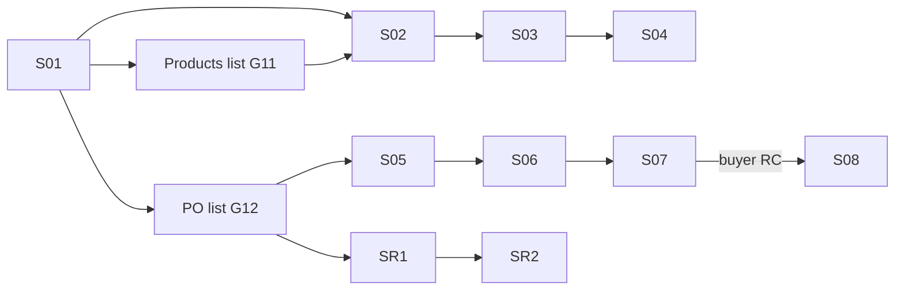

# App Module 08 — Supplier Workspace (S01–S08, SR1–SR2)

Backend: [marketplace](../../../backend/md/modules/11-marketplace.md), [payments-finance](../../../backend/md/modules/12-payments-finance.md). Onboarding (registration, KYB, consent K-S07) is covered in [module 01](01-access-onboarding.md).

Tabs: **Home · Products · Orders · Receivables · Account** (kit).

## Flow

*"After business registration and approval."* *"S08 starts after buyer acceptance, not carrier pickup. Returns route back to supplier review and resolution."*

## S01 — Supplier dashboard
*Packaging Factory • approved account.*
- Hero tile *New orders — 08*.
- *Active listings — 24*, *Net receivables — 11,580 SAR* (kit: "pending settlement • illustrative values"), *Quick actions — Add product / manage inventory*.
- Kit S01 rows: *New orders (3 need preparation)*, *Product catalog (24 products • 2 low stock)*, *Receivables (commission and transfer details)*.
- Alerts: low stock, readiness due today, return requests, licence expiry.
- **CTA:** `Add a listing` → S02.

## Products list (G11, kit K-S02 "Your products and inventory")
- Search *Search in your products*. Chips: *All / Active / Out of stock* (+ Low stock, Paused, Draft).
- Rows: *Packaging box — 5,000 pcs • 12 SAR — Active*; *Industrial pallet — 8 pcs • min 20 — Low stock*; *Protective packaging materials — 0 pcs — Unavailable*.
- Row actions: edit, pause/publish, update stock (quick sheet), duplicate.

## S02 — Photos and product details
*Use clear photos and accurate specifications.*

| Field | Rule |
|---|---|
| Product photos | *Upload multiple real photos* (1–10, reorder, the first is the cover). Camera or gallery |
| Name & category | *Shipping cartons • packaging* (category tree picker) |
| Description & specifications | *Size, material and use* (description + key/value spec rows, e.g. dimensions 40×30×30 cm) |
| Country of origin | *Saudi Arabia / other* |
| Packaging data (kit) | Packing and wrapping details |

- A draft is saved per step (listing drafts).
- **CTA:** `Pricing & inventory` → S03.

## S03 — Pricing and inventory
*Commercial details for your listing.*

| Field | Rule |
|---|---|
| Unit price & tax | *12 SAR • state VAT treatment* (price excluding / including VAT) |
| Minimum order | *100 units* |
| Stock & unit | *5,000 pieces* + unit of measure |
| Packaging & lead time | *100 pieces / pack • 2 days* |
| Other | *Supply notes* |

- Kit S03B includes the checkbox *"I confirm the product is original, new and matches the specifications"*, which V2 moves to S04.
- **CTA:** `Preview listing` → S04.

## S04 — Preview and publish
*Check every detail before publishing.*
- Buyer-view preview (image, name, price, MOQ, stock).
- *Product condition — New, original and specification-compliant*.
- *Listing details — Review images, price and stock*.
- Consent *☐ I confirm listing accuracy — Including intellectual property and quality*.
- *Sales commission — 3.5% per successful sale*.
- **CTA:** `Publish listing` → `POST /supplier/products/{id}/publish` → success. If pre-moderation is enabled, the status becomes "Under review".
- Note: *"Stock and listings can be edited later; prices on confirmed orders remain fixed."*

## PO list (G12, kit K-S04 "Supply orders")
- Tabs *New / In preparation / Completed*.
- Rows: *PO-260083 • Al Binaa Co. — 100 boxes • 1,200 SAR products — New*; *PO-260081 • Supply Est. — 200 boxes • due today — Preparing*.

## S05 — New purchase order
*PO-1048 • 100 cartons.*
- *Items — 100 × 12 SAR*, *Required readiness — Within two business days* (with a due date), *Buyer address — Riyadh*, *Confirmed price — Cannot change after confirmation*.
- Actions: `Start preparation` (implicitly accepts). A secondary `Reject order` requires a reason → the buyer gets a full refund. Rejecting affects the supplier's reliability metrics.
- Message buyer (PO conversation).

## S06 — Shipment readiness
*Packing, documents and carrier handover.*
- *Prepared quantity — 100 units*, *Packaging photos — Attach readiness evidence*, *Sales documents — Invoice and packing list*, *Pickup slot — 30/09/2026 • 10:00*.
- Kit S05 checklist: ☐ full quantity prepared, ☐ specification match inspected, ☐ safe packaging ready for transport, plus loading instructions and message buyer.
- **CTA:** `Mark ready for pickup` → creates or links the transport order (per the shipping method).

## S07 — Handover to carrier
*Approved transport is linked to the purchase.*
- *Linked transport order — TR-1048* (tap → tracking view), *Carrier & driver — View assigned provider*, *Quantity & condition — Record unit count and photos*, *Collection proof — Carrier signature and pickup time*.
- **CTA:** `Confirm carrier handover`.
- For supplier delivery (own vehicle), the supplier records the delivery POD instead.

## S08 — Sales settlement
*After buyer receipt and conformity confirmation.*
- *Illustrative sale value — 1,200 SAR*, *3.5% commission — 42 SAR*, *Illustrative net — 1,158 SAR*, *Transfer — Within 3 business days to the business account*, *Financial details — Commission tax and fees shown separately*.
- Status: Scheduled (date) / On hold (return window open or case) / Paid (TRX ref).
- **CTA:** `View settlement statement` (PDF).

## Receivables tab (G13)
Totals (pending, scheduled, paid this month), a settlements list with statuses and a bank account shortcut (G04).

## SR1 — Review return request
*Supplier • RT-1048.*
- *Customer reason — Specification mismatch*, *Evidence — Photos and listing comparison* (side-by-side listing photo vs evidence), *Decision and reason — Accept / request information / escalate*, *Window — 3 days after receipt under supplied policy*.
- **CTA:** `Submit decision`. Request information → the buyer is notified and can reply in the return thread. Escalate → the admin decides.

## SR2 — Resolve return
*Coordinate collection and resolution.*
- *Return logistics — Seller pays for non-conforming goods*, *Returned quantity — 10 units*, *Agreed resolution — Replacement or refund*, *Account adjustment — Link adjustment to sales order*.
- **CTA:** `Confirm resolution` → refund (deducted from the settlement) or a replacement PO.

## Acceptance criteria
- [ ] A listing can be created, previewed and published, and edits never change confirmed PO prices.
- [ ] The PO lifecycle (accept → prepare → ready → handover) matches backend states, and due-date alerts show.
- [ ] Settlement status reflects return-window holds and adjustments.
- [ ] Return decisions require reasons, and escalation hands off to admin.
