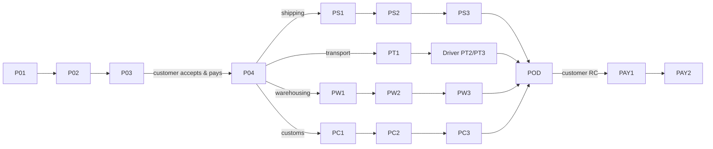

# App Module 09 — Provider Workspace

Covers P01–P04, PS1–PS3, PT1, PW1–PW3, PC1–PC3, POD, PAY1–PAY2 and the provider gap screens. Driver screens (PT2, PT3, driver POD) are in [module 10](10-driver.md).
Backend: [requests-quotes-matching](../../../backend/md/modules/05-requests-quotes-matching.md), [orders-execution-core](../../../backend/md/modules/06-orders-execution-core.md), modules 07–10 and 12.

Tabs: **Home · Requests · Operations · Receivables · Account** (kit).

## Flow

*"Each service opens its own execution workflow after acceptance. No unapproved charges are added."* *"After POD, the customer confirms in RC, then settlement begins. Provider evidence does not replace customer acceptance."*

## P01 — Provider opportunities (Home)
*Requests for your approved service activities.*
- Hero *Matching requests — 08 new requests* (kit K-P05: *"08 requests await your offer"*).
- Tiles: *Active jobs — 12*, *Receivables — 23,400 SAR*.
- *Filter — Activity, city and date*. Kit K-P06 tabs: *All / Road transport / Clearance / Storage*.
- Request cards (kit): *Jeddah → Riyadh — 18 t • trailer • 14 Oct — New*; *Dammam → Jeddah — 12 t • reefer • 16 Oct*; *Storage in Jeddah — 24 pallets • one month*.
- Kit K-P05 also links *Operations execution (3 active shipments)*, *Fleet & licences (vehicles and documents)*, *Receivables (commissions and settlements)*.
- Suspended activity or expired licence → a banner blocking quotes for that activity ("Renew your licence to receive requests").
- **CTA:** `Browse requests` → the Requests tab list.

## P02 — Service request details
*Read the scope before quoting.*
- *Service & route — Based on the selected request*. Kit K-P07: map, vehicle type (*trailer*), load (*18 TON*), units (*24*), readiness date (*14 Oct 2026*).
- *Quantity & dates — Customer-submitted details*.
- *Documents & requirements — View files and other requests*. Pre-award, only the document **types** are listed (D-16), and files appear after award.
- *Clarification — Ask a question in the order* → Q&A sheet (masked).
- Customer instructions (kit): *"Loading/unloading assistance. Forklift available at the loading point."*
- Customer identity is hidden: "Verified company • Riyadh".
- Actions: `Create quote` → P03. Secondary `Not interested` (optional reason).

## P03 — Prepare a quote
*A final price and a clear scope.*

| Field | Rule |
|---|---|
| Service fee | *Enter service charge* (SAR, > 0) |
| Tax & charges | *Itemized without hidden charges*: add line items (name, amount, taxable) |
| Duration & quote validity | *Set expiry date*: duration (e.g. *one day*) and validity (24 h default, 24–168 h) |
| Scope & exclusions | *Included services and conditions* (e.g. *includes loading and unloading*) |
| Other | *Operational notes* |
| Private planning (kit K-P08) | Internal operating cost (*1,800*), target margin (*360*). **Private to the provider**, with a lock icon and the hint "Not visible to the customer" |

- A live preview panel (from `/provider/quotes/preview`): price before tax 2,400, commission 10% = 240, net before commission taxes 2,160, **customer total with illustrative VAT 2,760**.
- **CTA:** `Send quote` → confirmation sheet → `POST /provider/quotes`.
- *"Internal cost and target margin remain private to the provider. Only the final customer-facing offer and its conditions are presented to the buyer."*

## My quotes (K-P08B "Your submitted offers")
- List: *LX-260148 • Jeddah → Riyadh — 2,760 SAR • valid 24 h — Customer's choice* (green); *LX-260144 • Dammam → Jeddah — 4,200 SAR • valid 12 h — Awaiting response*.
- Actions per quote: revise (before acceptance), withdraw. Expired or not-selected quotes go into history.
- Card *Execution confirmation — "Confirm your readiness after the customer's choice; execution starts after payment confirmation."* **CTA:** `Confirm readiness`.

## P04 — Your quote is accepted
*Check payment before starting work.*
- Success check. *Customer decision — Quote accepted*, *Payment status — Confirmed in this example*, *Start requirements — Documents and authorization if needed*, *Next step — Open the service execution workspace*.
- **CTA:** `Open execution workspace` (confirm readiness is done here if not done from My quotes) → the service execution screen.

## Operations tab (G10: active jobs)
List of orders by status (to schedule, in progress, awaiting customer acceptance, completed), with the next-action badge per job (e.g. "Upload B/L", "Assign driver", "Confirm intake slot", "Awaiting authorization").

## Shipping execution (freight providers)
- **PS1 Book freight capacity** (*Freight provider • sea, air or land*): *Mode & carrier — Select line, flight or road carrier*, *Capacity & schedule — Confirm capacity availability* (ETD/ETA), *Booking reference — Enter reference and upload confirmation*, *Other — Handling and partner details*. **CTA** `Confirm booking`.
- **PS2 Execution documents** (*Requirements vary by transport mode*): *Sea — B/L, container and seal number* (container number check-digit validation), *Air & express — AWB and parcel tracking reference*, *Land — Vehicle and border documents*, *Other — Additional operational file*. **CTA** `Save documents`.
- **PS3 Update shipment milestones** (*Your updates appear in the customer view*): *Pickup — Confirm cargo collection*, *Departure — Actual departure time*, *Arrival — Estimated or actual arrival*, *Final delivery — Assign the door-to-door final leg*. Each row opens a sheet (time, note, photos). **CTA** `Publish update`.

## Transport execution (carrier / broker)
- **PT1 Assign vehicle and driver** (*Transport company or transport broker*): *Vehicle — Available and suitable for the load* (picker filtered by type and availability; expired documents disabled with a reason), *Driver — Approved, available driver*, *Transport broker — Select a qualified carrier instead of own fleet* (external carrier form: company, driver name/phone, plate, vehicle type), *Documents — Operating card and relevant insurance*. **CTA** `Confirm assignment`.
- Kit K-P09 *Execute the shipment*: vehicle assignment (*trailer — 4821*), driver name (*Mohammed*), execution stage (*before departure*), shipping document (*issue/attach per integration*), ☐ *units and goods condition verified*, a "Save event" note (*the system records time and who updated; integrations and GPS not connected in the prototype*), **CTA** `Record proof of delivery`.
- **Fleet (G07):** vehicles list (plate, type, capacity, document expiry badges), add/edit vehicle (+ operating card, insurance uploads).
- **Drivers (G08):** list, invite by phone (name, licence number and expiry, licence photo), suspend.
- **Live trips:** a map of active trips for the provider's fleet or assigned carriers (*"brokers monitor assigned carriers"*).

## Warehouse execution
- **PW1 Capacity and intake slots** (*Warehouse provider • approved order*): *Available capacity — 30 pallet spaces*, *Booked capacity — 20 pallet spaces*, *Storage environment — Dry / temperature-controlled per contract*, *Intake slot — 01/10/2026 • 10:00* (propose 1–3 slots). **CTA** `Confirm intake slot`.
- **PW2 Receive and count goods** (*Compare received stock with the booking*): *Expected quantity — 20 pallets*, *Actual quantity — 20 pallets*, *Condition check — Photos, notes and discrepancies*, *Storage location — A-04 • attach stock record*. **CTA** `Confirm stock intake`. A discrepancy requires a note and photos.
- **PW3 Stock and release management** (*WH-105 • release request for 2 pallets*): *Available stock — 18 pallets*, *Customer request — 2 pallets • 15 October*, *Picking — Select units and storage location*, *Collector — Approved carrier and trip reference*. **CTA** `Approve stock release` → then picking/ready/handover steps.
- **Sites (G09):** warehouse sites with capacity and storage types.
- *"Each movement updates the customer balance. Partial release does not close the storage contract."*

## Customs broker execution
- **PC1 Review customs file** (*Customs broker • import / export / transit*): *Movement & checkpoint — Review customer details*, *Documents — Accept or request changes per file* (per-document accept/reject with reason codes), *Origin & SABER certificates — Review as applicable*, *Other — Request another document with a reason*. **CTA** `Send review result`.
- **PC2 Check broker authorization** (*Do not perform a step requiring an inactive mandate*): *Authorizing business — View registration details*, *Authorization reference — Awaiting official confirmation* (enter the reference + evidence to activate), *Scope & validity — Match the operation and validity*, *Required action — Notify customer to complete activation*. **CTA** `Check authorization`.
- **PC3 Declaration execution** (*Manual updates or an approved active integration*): *Declaration reference — Enter the actual reference*, *Manifest — Link reference and available files*, *Inspection & duties — Update status and attach evidence*, *Update source — Broker • date and time*. **CTA** `Update clearance status`. Disabled with an explanation if the authorization isn't active.

## POD — Service completion evidence (all services)
*Provider submits evidence first.*
- *Service reference — LX-2048*, *Completion evidence — Photos / release notice / signature* (by service: photos + signature for deliveries, the release notice for customs, final handover + reconciliation for warehousing), *Recipient & time — Record the actual handover*, *Next stage — Awaiting customer acceptance*.
- **CTA:** `Send evidence to customer`.
- *"Completion evidence here is the release notice. Clearance acceptance differs from physical goods receipt."* (customs)

## Additional charges
From the job, "Propose additional charge" (description, amount, taxable) → the customer approves or rejects. The status is shown on the job.

## PAY1 — Provider settlement
*After completion and customer acceptance.*
- Rate tabs (kit K-P11): *Transport 10% / Clearance 20% / Storage 20%*.
- *Freight & transport — 10% commission*, *Customs & storage — 20% commission*, *Settlement statement — Gross amount, commission, tax and net* (e.g. calculated 2,400 − commission 240 = net before commission taxes 2,160), *Payout — Within 3 business days to approved account*, bank account (masked), order *LX-260148 — awaiting receipt confirmation*.
- **CTA:** `View settlement statement` (PDF).

## PAY2 — Payout completed
*A transparent per-order statement.*
- Success. *Beneficiary account — Approved business bank account*, *Transfer reference — TRX-2048*, *Transfer date — After settlement conditions are met*, *Statement — Download transaction statement*.
- **CTA:** `Download statement`.

## Acceptance criteria
- [ ] Providers see only matching requests with pre-award restrictions, and suspended activities are blocked with guidance.
- [ ] Private cost and margin are never sent in customer-facing payloads (verified in tests). The preview math matches the backend.
- [ ] Each service execution screen enforces its guards (e.g. PC3 needs an active mandate, PT1 blocks expired assets).
- [ ] POD submission moves the order to awaiting acceptance, and settlement appears only after customer RC.
