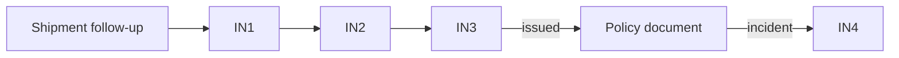

# App Module 11 — Cargo Insurance (IN1–IN4)

Backend: [insurance](../../../backend/md/modules/14-insurance.md). *"Optional service linked to a shipment."* *"IN4 is an optional post-issuance claim path. No insurer partnership, automatic issuance or commission is assumed."*

## Entry points
- SH06 *Cargo insurance — Compare insurers and coverage* (flag saved; offered after award).
- SHF/SH08 follow-up: *Documents & actions — Order files, insurance and notes* → "Insure this shipment" (before departure only).
- Kit B01/Q02 notes mention insurance coverage in offers: provider-included insurance (carrier liability) is shown in the quote scope and is **not** the same as cargo insurance. The UI copy must make the difference clear.

## Flow

## IN1 — Cargo insurance providers
*Compare coverage for your shipment.*
- Cards: *Insurer A — Sea and road cargo coverage*; *Insurer B — Air and express cargo coverage* (filtered by the shipment mode).
- *Compare options — Limits, exclusions and deductible* → a comparison sheet.
- *Note — Illustrative names, not contracted insurers* (shown while no contracted insurers exist. Staff control the list).
- **CTA:** `View coverage` → IN2 for the selected insurer.

## IN2 — Coverage details
*Read the terms before requesting insurance.*

| Field | Rule |
|---|---|
| Declared cargo value | Required, SAR (*50,000 SAR*). Hint: "Use the commercial invoice value" |
| Route & commodity | *From shipment request* (read-only) |
| Coverage & exclusions | *View insurer terms document* (PDF viewer) |
| Deductible & premium | *As stated in the insurer quote*. Empty until quoted |
| Consent | *☐ I accept insurance terms — Separate consent from transport terms* (never pre-checked) |

**CTA:** `Request insurance quote` → `POST /insurance/requests`.

## IN3 — Insurance request and policy
*Linked to shipment LX-2048.*
- Timeline:
  - *Quote request — Under insurer review*
  - *Premium approval — Customer acceptance then payment* (when `QUOTED`: shows premium, deductible, limits and validity, with `Accept & pay` / decline)
  - *Policy issuance — No active coverage before confirmed issuance*
  - *Policy document — Available after issuance* (view/download)
- Payment per D-07: in-app payment (if licensed) or instructions to pay the insurer directly, with a "I've paid" confirmation that staff verify.
- **CTA:** `Track insurance request` (refresh). The wording "insured" appears only after `ISSUED`.

## IN4 — Insurance claim request
*Submit a claim to the insurer.*

| Field | Rule |
|---|---|
| Policy & shipment | *Select the linked policy* |
| Incident details | Date (≤ today, within policy dates) + description |
| Evidence | *Photos, delivery record and invoice* (photos required; RC and POD evidence can be attached from the order) |
| Claim status | *Coverage and compensation decided by insurer* (after submission) |

**CTA:** `Submit claim` → status timeline (submitted → with insurer → approved/rejected → paid).

## Acceptance criteria
- [ ] Insurance consent is separate and never pre-checked.
- [ ] No coverage wording appears before issuance, and the policy PDF is available after.
- [ ] Claims attach existing order evidence without re-upload.
- [ ] Insurance is unavailable after the shipment has departed (server-enforced, UI explains).
