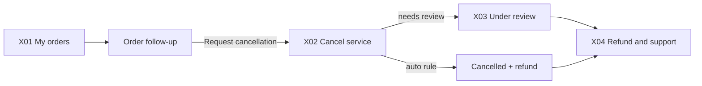

# App Module 12 — Cancellation, Refunds and Support (X01–X04)

Backend: [cancellations-refunds-cases](../../../backend/md/modules/13-cancellations-refunds-cases.md). *"Alternative path from order details."*

## Flow

## X01 — My orders
Specified in [module 02](02-customer-home-orders-completion.md#x01--my-orders-unified-feed). Here it's the starting point: *Filter — Choose service or marketplace*, and items such as *Order LX-2048 — In progress • open follow-up*, *Order WH-105 — Active storage*, *Purchase PO-1048 — In preparation*. **CTA** `Open order`.

## X02 — Cancel service
*Review the financial impact first.*
- The rule table from `GET /orders/{id}/cancellation-preview` (always shown, so the customer understands the policy):
  - *Before acceptance or dispatch — 0% under the supplied text*
  - *After acceptance, before arrival — 10% of service value*
  - *After arrival or customs start — 25% of service value*
  - *After pickup and transport start — 100% + return costs if possible*
- The current stage row is highlighted.
- *Expected charge — Shown after unambiguous stage resolution*: if the preview is `AUTO`, show *"Cancellation fee: 276 SAR • Refund: 2,484 SAR"*; if `REQUIRES_REVIEW`, show *"Needs review before any charge. No amount will be deducted until a decision"*.
- Reason picker (required) + note.
- **CTA:** `Review cancellation` → confirmation sheet (fee, refund, "The provider will be notified to stop work") → `POST …/cancellation-requests`.
- If not allowed (e.g. awaiting acceptance or completed): the X02 entry is hidden, and "Open a case instead" is offered.

## X03 — Cancellation under review
*The stage rules overlap.*
- *Order status — Accepted, provider not dispatched*
- *Review reason — Supplied rules imply both 0% and 10%*
- *Action — Human review before any charge*
- *Decision — Notify customer of amount and reason*
- Order work is paused (a provider banner).
- **CTA:** `Track request` → X04 when decided.
- *"Free cancellation before dispatch conflicts with 10% after acceptance; the policy owner must resolve this before implementation."* (D-01): this screen exists to handle that safely.

## X04 — Refund and support
*Track the decision and amount.*
- Timeline:
  - *Case reference — CASE-2048*
  - *Approved amount — Determined after case review* (then the actual amount and fee with the reason)
  - *Refund status — Processing* (then *Refunded to mada •••• 1234 on …*)
  - *Support — Chat with support* (accent)
- **CTA:** `Open conversation` → case conversation (support thread).
- Refund timing note: "Refunds usually appear within X business days depending on your bank" (copy per D-14).

## Supplier and provider side
- Provider: when a cancellation is requested or decided, the job shows a banner and execution actions are paused. A decided cancellation shows the fee compensation (per D-14) in receivables.
- Provider-initiated cancellation: from the job's "more" menu → reason → confirmation that shows the penalty/reliability impact → `POST /provider/orders/{id}/cancel`.
- Purchase orders: the buyer can cancel free before the supplier accepts (from M09). After that, a review is required.

## Support entry points (G16, G18)
- DONE *Open an order-linked case*, RC *Report shortage or damage*, X07 *Contact support with transaction reference*, Account → Help centre.
- Case form: type (prefilled by context), description, attachments → `POST /cases`.
- Case detail: status, SLA hint ("We usually respond within 4 business hours"), conversation, attachments, resolution. Reopen within 7 days.
- Help centre (G18): FAQs by topic (bilingual, managed in the dashboard), contact options (chat, phone/WhatsApp number from `/app-config`).

## Acceptance criteria
- [ ] The preview shown equals the backend decision for automatic cases, and review cases never show a fee as final.
- [ ] Cancellation pauses provider execution UI immediately (realtime).
- [ ] Refund status updates are visible in X04, with amount and method.
- [ ] Every case is reachable from the related order, and support chat works with attachments.
