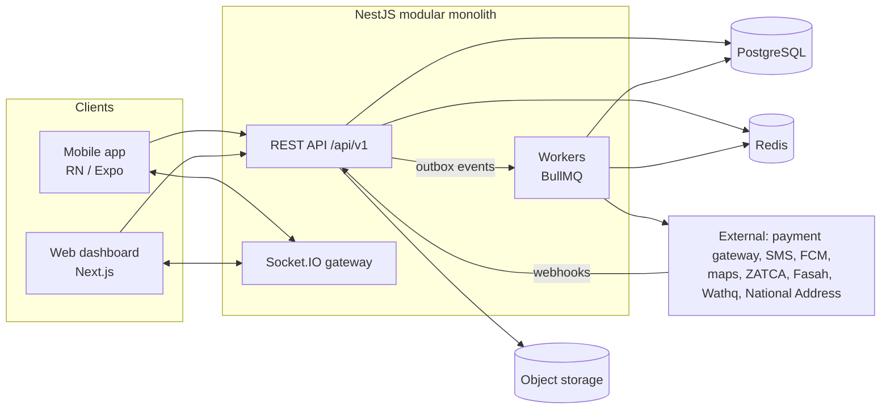

# Backend — Overview

## 1. Purpose

The backend is the single source of truth for Logix. It exposes APIs to:

- the **mobile app** (customer, supplier, provider and driver workspaces), and
- the **web dashboard** (Logix staff).

It owns identity, verification, the request → quote → order → settlement lifecycle for the four logistics services, the marketplace, payments and the ledger, documents, tracking, messaging, notifications and all external integrations.

## 2. Scope

| In scope | Out of scope (for now) |
|---|---|
| Phone OTP auth, sessions, multi-workspace users | Social login |
| Organizations, KYB, licences, bank accounts, terms and consent audit | Automated identity (Nafath) verification. Candidate for Phase 4 |
| Service requests for Shipping, Transport, Warehousing, Customs | Rate cards or instant pricing for services (all service pricing is quote-based) |
| Provider matching, quotes, comparison data | Automated provider ranking/ML |
| Orders, milestones, tracking (GPS for road legs), POD, receipt confirmation, ratings | Telematics / WASL integration (Phase 4 candidate) |
| Warehouse inventory, intake, releases, reconciliation | Full WMS (bin optimisation, cycle counts) |
| Customs file, broker authorization, declaration status (manual first) | Direct Fasah filing until integration is approved |
| Marketplace: listings, search, cart, checkout, purchase orders, returns | Multi-currency, cross-border marketplace |
| Payments via one gateway, refunds, double-entry ledger, commissions, VAT, invoices, settlements, payout batches | Automated bank payouts (manual batch in MVP) |
| Cancellations with a policy engine and human review, cases and disputes | Automated dispute arbitration |
| Insurance request/policy/claim records (ops-driven) | Insurer API integration, automatic issuance |
| In-app, push, SMS and email notifications and chat | Voice/VoIP calls |
| Admin APIs, RBAC, audit log, reporting | BI warehouse (Phase 4) |

## 3. Guiding principles

1. **Modular monolith first.** One NestJS deployable with strict module boundaries. Extract services only when load or team structure requires it.
2. **Money is sacred.** Integer halalas, a double-entry ledger, idempotent payment operations, and gateway-confirmed payment status only (*"Payment success is shown only after gateway confirmation in production"*).
3. **State machines, not flags.** Every lifecycle (request, quote, order, payment, settlement, document, KYB, authorization, return, cancellation, insurance, case) has an explicit state machine with guarded transitions ([04-state-machines.md](04-state-machines.md)).
4. **Source and timestamp on every update.** Tracking and status updates record who or what produced them: provider, driver, broker, customer, admin or integration (a client requirement).
5. **Customer acceptance precedes payout.** Provider evidence (POD) never replaces customer acceptance (RC).
6. **No unapproved charges.** Any additional charge after quote acceptance needs explicit customer approval and its own payment.
7. **Illustrative ≠ approved.** Commission, VAT treatment, cancellation and return rules are configuration with effective dates, not constants in code.
8. **Bilingual by design.** APIs return codes, clients localize. Server-rendered text (push, SMS, email, PDF) is localized using the user's locale.
9. **Least privilege.** Every endpoint enforces membership and ownership checks. Internal costs and margins of providers are never exposed to customers.
10. **Credentials server-side.** Integration secrets (gateway, Fasah, SMS) never ship in the mobile app.

## 4. High-level architecture

Details: [02-architecture.md](02-architecture.md).

## 5. Module map

| # | Module | Doc |
|---|---|---|
| 1 | Auth and identity (OTP, sessions, users) | [modules/01-auth-identity.md](modules/01-auth-identity.md) |
| 2 | Organizations, workspaces, KYB, licences, bank accounts, terms and consent | [modules/02-organizations-kyb-terms.md](modules/02-organizations-kyb-terms.md) |
| 3 | Reference data (cities, ports, checkpoints, vehicle/container types…) | [modules/03-reference-data.md](modules/03-reference-data.md) |
| 4 | Files and documents | [modules/04-files-documents.md](modules/04-files-documents.md) |
| 5 | Service requests, matching, quotes | [modules/05-requests-quotes-matching.md](modules/05-requests-quotes-matching.md) |
| 6 | Orders and execution core (milestones, POD, RC, rating, linked orders, extra charges) | [modules/06-orders-execution-core.md](modules/06-orders-execution-core.md) |
| 7 | Shipping / freight | [modules/07-shipping-freight.md](modules/07-shipping-freight.md) |
| 8 | Transport, fleet, drivers, GPS | [modules/08-transport-fleet.md](modules/08-transport-fleet.md) |
| 9 | Warehousing | [modules/09-warehousing.md](modules/09-warehousing.md) |
| 10 | Customs | [modules/10-customs.md](modules/10-customs.md) |
| 11 | Marketplace | [modules/11-marketplace.md](modules/11-marketplace.md) |
| 12 | Payments, ledger, commissions, invoices, settlements, payouts | [modules/12-payments-finance.md](modules/12-payments-finance.md) |
| 13 | Cancellations, refunds, cases and disputes | [modules/13-cancellations-refunds-cases.md](modules/13-cancellations-refunds-cases.md) |
| 14 | Insurance | [modules/14-insurance.md](modules/14-insurance.md) |
| 15 | Messaging and notifications | [modules/15-messaging-notifications.md](modules/15-messaging-notifications.md) |
| 16 | Admin, audit, reporting | [modules/16-admin-audit-reporting.md](modules/16-admin-audit-reporting.md) |
| 17 | Integrations | [modules/17-integrations.md](modules/17-integrations.md) |

## 6. Document map

| Doc | Content |
|---|---|
| [01-tech-stack.md](01-tech-stack.md) | Chosen technologies with rationale and alternatives |
| [02-architecture.md](02-architecture.md) | Layering, module boundaries, events/outbox, jobs, realtime, files, environments |
| [03-domain-model.md](03-domain-model.md) | Entities, relationships, reference numbers, enums |
| [11-database-schema.md](11-database-schema.md) | Full PostgreSQL DDL: 136 tables, enums, constraints, indexes, triggers, partitioning, grants |
| [04-state-machines.md](04-state-machines.md) | All lifecycles with transitions and guards |
| [05-api-conventions.md](05-api-conventions.md) | REST, errors, pagination, idempotency, i18n, realtime events, webhooks |
| [06-security-compliance.md](06-security-compliance.md) | AuthN/Z, data protection, PDPL, audit, secrets |
| [07-infrastructure-devops.md](07-infrastructure-devops.md) | Hosting, CI/CD, observability, backups |
| [08-testing-quality.md](08-testing-quality.md) | Test strategy and release acceptance criteria |
| [09-open-decisions.md](09-open-decisions.md) | **Master decisions log** (business and technical) |
| [10-roadmap.md](10-roadmap.md) | Backend epics per phase with sizing |
| [12-execution-plan.md](12-execution-plan.md) | Build order in vertical slices, app ↔ API contract, definition of done |
