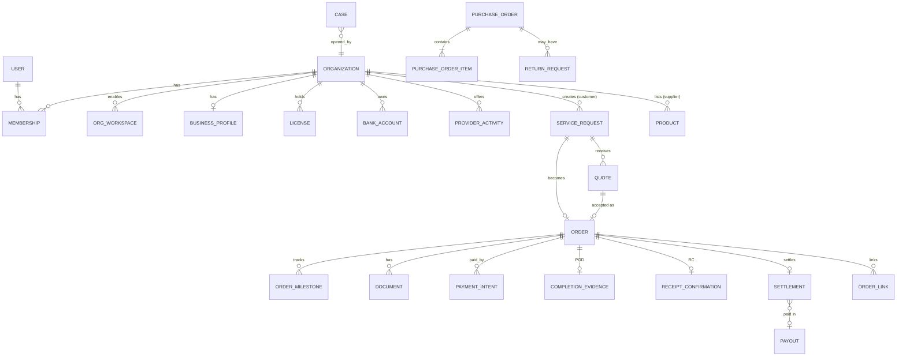

# Backend — Domain Model

Source of truth for entity names, key fields, reference numbers and enums. Field lists are the **important** fields, not full DDL. The physical schema (column types, constraints, indexes, exclusive-arc links) is in [11-database-schema.md](11-database-schema.md). Where the two differ in detail, the schema file wins. Every table also has `id` (UUIDv7), `created_at`, `updated_at` and, where relevant, `version` (optimistic lock) and `deleted_at` (soft delete for user-managed data only, never for financial data).

## 1. Aggregates at a glance

## 2. Identity and access

**User**: `phone` (E.164, unique), `email?`, `full_name`, `locale` (`ar`|`en`), `status` (`ACTIVE`|`SUSPENDED`|`DELETED`), `last_login_at`.

**Session**: `user_id`, `device_id`, `platform` (`ios`|`android`|`web`), `app_version`, `push_token?`, `refresh_token_hash`, `ip`, `user_agent`, `last_seen_at`, `revoked_at?`. Powers X06 "Manage sessions and sign out".

**Organization** (the account that owns everything): `kind` (`INDIVIDUAL`|`BUSINESS`), `display_name`, `status` (`ACTIVE`|`SUSPENDED`|`CLOSED`), `default_locale`. An individual customer gets a one-member `INDIVIDUAL` organization, so ownership is uniform.

**Membership**: `user_id`, `organization_id`, `role` (`OWNER`|`MANAGER`|`MEMBER`|`DRIVER`), `status` (`INVITED`|`ACTIVE`|`REMOVED`). MVP: `OWNER` + `DRIVER` only (D-19).

**OrgWorkspace**: `organization_id`, `workspace` (`CUSTOMER`|`SUPPLIER`|`PROVIDER`), `status` (`PENDING_VERIFICATION`|`ACTIVE`|`SUSPENDED`|`REJECTED`). A `DRIVER` membership implies the driver workspace under a `PROVIDER` org.

**StaffUser** (dashboard): `email`, `full_name`, `password_hash` (argon2), `totp_secret` (encrypted), `roles[]`, `status`, `last_login_at`.

## 3. Organizations, KYB and terms

**BusinessProfile**: `organization_id`, `legal_name`, `trade_name`, `cr_number`, `cr_expiry`, `vat_number?`, `national_address` (building no, street, district, city, postal code, additional no, short address), `contact_phone`, `contact_email`, `verification_status`.

**ProviderActivity**: `organization_id`, `activity` (enum below), `status` (`PENDING`|`APPROVED`|`SUSPENDED`|`REJECTED`), `service_areas` (cities/regions), `lanes` (origin/destination countries or ports for freight), `checkpoints[]` (customs), `notes`.

`ProviderActivity.activity`: `FREIGHT_SEA`, `FREIGHT_AIR`, `FREIGHT_LAND`, `EXPRESS`, `TRANSPORT_CARRIER`, `TRANSPORT_BROKER`, `WAREHOUSE`, `CUSTOMS_BROKER`.

**License**: `organization_id`, `type` (`COMMERCIAL_REGISTRATION`, `TGA_TRANSPORT_LICENSE`, `CUSTOMS_BROKER_LICENSE`, `VAT_CERTIFICATE`, `NATIONAL_ADDRESS_PROOF`, `INSURANCE_POLICY`, `WAREHOUSE_LICENSE`, `OTHER`), `number`, `issued_at?`, `expires_at?`, `document_id`, `status` (`PENDING`|`VALID`|`CHANGES_REQUESTED`|`EXPIRED`|`REJECTED`).

**BankAccount**: `organization_id`, `iban` (encrypted, SA IBAN validated), `iban_last4`, `bank_name`, `account_holder_name` (must match legal name), `proof_document_id`, `status` (`PENDING`|`VERIFIED`|`REJECTED`), `is_default`.

**VerificationCase**: `organization_id`, `workspace`, `status` (see state machines), `submitted_at`, `decided_at`, `reviewer_staff_id`, `decision_reason`. **VerificationItem**: `case_id`, `item_type` (`BUSINESS_PROFILE`|`LICENSE`|`BANK_ACCOUNT`|`ACTIVITY`), `ref_id`, `status`, `reason`.

**TermsDocument**: `audience` (`CUSTOMER`|`SUPPLIER`|`PROVIDER`|`PURCHASE`|`INSURANCE`|`PRIVACY`), `version` (semver), `locale`, `title`, `body_markdown`, `summary_items[]`, `published_at`, `is_current`.

**Consent**: `user_id`, `organization_id`, `workspace`, `consent_key` (e.g. `TERMS_ACCEPTANCE`, `REQUEST_ACCURACY`, `QUOTED_SCOPE`, `RECEIPT_CONFIRMATION`, `LISTING_ACCURACY`, `INSURANCE_TERMS`, `PURCHASE_TERMS`, `BROKER_AUTHORIZATION`), `terms_document_id?`, `terms_version?`, `context_type?` + `context_id?` (order/request/product), `context_reference?` (LX-…), `accepted_at`, `ip`, `device_id`. Append-only.

## 4. Reference data

`Country`, `City` (`region`, `name_ar`, `name_en`, `geo`), `Port` (`unlocode`, `type`: `SEA`|`AIR`|`LAND_BORDER`|`DRY_PORT`, `iata?`), `CustomsCheckpoint` (links to Port), `VehicleType` (`code`, names, `capacity_ton?`, `is_car_carrier`, `is_reefer`), `ContainerType` (`20DC`, `40DC`, `40HC`, `20RF`, `40RF`, `LCL`), `StorageType` (`DRY`, `CHILLED`, `FROZEN`, `OTHER`), `CommodityCategory`, `ProductCategory` (tree), `DocumentType` (see files module), `UnitOfMeasure`, `Holiday` (`date`, `name`, `is_business_day=false`). All bilingual and admin-managed. See [modules/03-reference-data.md](modules/03-reference-data.md).

## 5. Service requests and quotes

**ServiceRequest**: `reference` (`LX-YY######`), `service_type` (`SHIPPING`|`TRANSPORT`|`WAREHOUSING`|`CUSTOMS`), `customer_org_id`, `created_by_user_id`, `status`, `submitted_at`, `expires_at`, `origin_summary`, `destination_summary`, `service_date` (ready/transport/start date), `notes`, `other_requirements`, `accuracy_consent_id`, `parent_order_id?` (linked requests), `matched_provider_count`, `quote_count`.

Per-service details (1:1 with the request, typed columns for fields used in filters and JSONB `extras` for the rest):

- **ShippingRequestDetails**: `mode` (`SEA`|`AIR`|`LAND`), `is_express`, `is_door_to_door`, `trade_direction` (`IMPORT`|`EXPORT`), `origin_country`, `origin_port_id?`, `destination_country`, `destination_port_id?`, `origin_city?`, `destination_city?`, `commodity`, `hs_code?`, `container_type?`, `container_size?` (`20`|`40`|`LCL`), `container_count?`, `weight_kg`, `volume_cbm?`, `package_count?`, `packages[]` (L×W×H cm, weight), `pallet_count?`, `pickup_address_id?`, `delivery_address_id?`, `pickup_window?`, `contacts` (sender/recipient), `access_notes?`, `wants_customs_clearance`, `wants_insurance`.
- **TransportRequestDetails**: `scope` (`DOMESTIC`|`CROSS_BORDER`), `vehicle_type_id`, `vehicle_description?`, `pickup` / `dropoff` (address id, lat/lng, contact name and phone), `transport_date`, `transport_time?`, `commodity?`, `weight_value?`, `weight_unit?` (`KG`|`TON`), `quantity?` + `quantity_unit?` (pallets/units), `loading_assistance` (`ASSISTANCE`|`FORKLIFT`|`NONE`), `temperature_c?`, `special_handling?`, `vehicles_count?` (car carrier), `route_distance_km?`, `route_duration_min?`.
- **WarehousingRequestDetails**: `city_id`, `storage_type`, `start_date`, `end_date`, `space_value`, `space_unit` (`PALLET_POSITIONS`|`SQM`), `commodity`, `quantity`, `quantity_unit`, `weight_kg?`, `temperature_range?`, `handling_services[]` (`RECEIVING`|`LOADING`|`SORTING`|`LABELING`|`OTHER`), `transport_to_warehouse` (`LINKED`|`SELF`).
- **CustomsRequestDetails**: `movement` (`IMPORT`|`EXPORT`|`TRANSIT`), `checkpoint_type`, `checkpoint_id`, `cargo_type`, `cargo_quantity`, `bill_of_lading_no?`, `hs_code?`, `goods_description`, `arrival_port_id?`, `departure_port_id?`, `transit_destination?`, `exit_checkpoint_id?`, `shipment_quantity?`.

**RequestMatch**: `request_id`, `provider_org_id`, `activity`, `notified_at`, `viewed_at?`, `quoted_at?`, `declined_at?`.

**RequestQuestion**: `request_id`, `provider_org_id`, `question`, `answer?`, `answered_at?`. This is the pre-award clarification in P02, with contact details masked.

**Quote**: `request_id`, `provider_org_id`, `status`, `currency`, `service_fee`, `charges[]` (`label`, `amount`, `taxable`), `subtotal`, `vat_rate_bps`, `vat_amount`, `total_amount`, `estimated_duration` / `eta_date`, `valid_until`, `scope_included`, `exclusions`, `notes`, `internal_cost?` + `target_margin?` (**provider-private, never serialized to customers**), `commission_rate_bps_preview`, `net_to_provider_preview`, `submitted_at`, `revision`.

## 6. Orders and execution

**Order**: `reference` (same as request), `service_type`, `request_id`, `accepted_quote_id`, `customer_org_id`, `provider_org_id`, `status`, `payment_status`, amounts snapshot (`service_fee`, `charges`, `vat_amount`, `total_amount`, `commission_rate_bps`, `commission_amount`, `commission_vat_amount`, `net_to_provider`), `confirmed_at`, `started_at`, `pod_at`, `accepted_at`, `completed_at`, `cancelled_at`, `settlement_status`, `current_milestone_code`, `version`.

**OrderLink**: `parent_order_id`, `child_type` (`ORDER`|`PURCHASE_ORDER`|`INSURANCE_REQUEST`), `child_id`, `link_type` (`CUSTOMS_FOR_SHIPMENT`, `DELIVERY_LEG`, `TRANSPORT_TO_WAREHOUSE`, `PORT_COLLECTION`, `PURCHASE_DELIVERY`, `INSURANCE`).

**OrderMilestone**: `order_id`, `code`, `sequence`, `status` (`PENDING`|`DONE`|`SKIPPED`), `estimated_at?`, `occurred_at?`, `source` (`PROVIDER`|`DRIVER`|`BROKER`|`CUSTOMER`|`ADMIN`|`INTEGRATION`), `recorded_by_user_id?`, `note?`, `location?`, `evidence_document_ids[]`.

**AdditionalCharge**: `order_id`, `proposed_by_org_id`, `description`, `amount`, `vat_amount`, `status` (`PROPOSED`|`APPROVED`|`REJECTED`|`PAID`), `decided_at`. This enforces the "no unapproved charges" rule.

**CompletionEvidence (POD)**: `order_id`, `submitted_by_user_id`, `photos[]`, `signature_file_id?`, `release_notice_document_id?`, `recipient_name`, `handed_over_at`, `note`.

**ReceiptConfirmation (RC)**: `subject_type` (`ORDER`|`PURCHASE_ORDER`), `subject_id`, `condition` (`INTACT`|`SHORTAGE`|`DAMAGE`), `unit_count_confirmed`, `recipient_name`, `signature_file_id?`, `photos[]`, `notes`, `confirmed_at`, `confirmed_by_user_id`, `consent_id`.

**Rating**: `subject_type`, `subject_id`, `rater_org_id`, `ratee_org_id`, `stars` (1–5), `comment?`, `status` (`PUBLISHED`|`HIDDEN`).

Service-specific execution entities are defined in the shipping, transport, warehousing and customs module docs (FreightBooking, Vehicle, Driver, TripAssignment, TrackingPoint, StorageContract, StockMovement, ReleaseRequest, BrokerAuthorization, CustomsDeclaration…).

## 7. Marketplace

`Product` (`supplier_org_id`, `category_id`, `name`, `description`, `specs` JSONB, `origin_country`, `condition`, `unit`, `unit_price`, `vat_treatment` (`INCLUSIVE`|`EXCLUSIVE`), `moq`, `stock_qty`, `pack_size`, `lead_time_days`, `city_id`, `status`), `ProductImage`, `Favorite`, `Cart` / `CartItem` (`saved_for_later`), `PurchaseOrder` (`reference` `PO-…`, buyer, supplier, `status`, totals, `delivery_address`, `shipping_method`, `linked_transport_order_id?`, `readiness_due_at`), `PurchaseOrderItem` (price snapshot), `ShipmentReadiness`, `ReturnRequest` (`reference` `RT-…`). See [modules/11-marketplace.md](modules/11-marketplace.md).

## 8. Finance

`PaymentIntent` (`payable_type`: `ORDER`|`PURCHASE_ORDER`|`ADDITIONAL_CHARGE`|`INSURANCE_PREMIUM`, `amount`, `method`, `gateway`, `gateway_payment_id`, `status`, `idempotency_key`), `PaymentEvent` (raw webhook log), `Refund`, `LedgerAccount`, `LedgerTransaction` + `LedgerEntry` (double-entry, immutable), `CommissionRule` (versioned with effective dates), `Invoice` (`INV-…`, type, ZATCA fields), `Settlement` (`STL-…`), `PayoutBatch`, `Payout` (`TRX-…`). See [modules/12-payments-finance.md](modules/12-payments-finance.md).

## 9. Cancellations, cases, insurance, messaging

`CancellationRequest`, `Case` (`CASE-…`), `Insurer`, `InsuranceRequest`, `InsurancePolicy`, `InsuranceClaim`, `Conversation`, `ConversationParticipant`, `Message`, `Notification`, `NotificationPreference`, `NotificationTemplate`, `AuditLog`, `OutboxEvent`, `FeatureFlag`. See the respective module docs.

## 10. Reference numbers

| Prefix | Entity | Format | Example |
|---|---|---|---|
| `LX` | Service request and its order | `LX-{YY}{seq:4+}` | `LX-260148` |
| `PO` | Purchase order | `PO-{YY}{seq:4+}` | `PO-260083` |
| `RT` | Marketplace return | `RT-{YY}{seq:4+}` | `RT-260012` |
| `CASE` | Case / dispute / support | `CASE-{YY}{seq:4+}` | `CASE-262048` |
| `STL` | Settlement statement | `STL-{YY}{seq:5+}` | `STL-2600412` |
| `TRX` | Payout transfer | `TRX-{YY}{seq:5+}` | `TRX-2602048` |
| `INV` / `CN` | Invoice / credit note | `INV-{YYYY}-{seq:6}` (gap-free per issuer, ZATCA) | `INV-2026-000154` |
| `-R{n}` | Warehouse release | `{order ref}-R{n}` | `LX-260148-R2` |

Sequences come from PostgreSQL sequences per prefix and year. Invoice numbers must be **gap-free per issuer**, so they are allocated inside the invoicing transaction, not from a global sequence. Per-service prefixes (`WH-`, `TR-`) are an open minor decision (D-27).

## 11. Cross-cutting enums (canonical)

- `ServiceType`: `SHIPPING`, `TRANSPORT`, `WAREHOUSING`, `CUSTOMS`
- `Workspace`: `CUSTOMER`, `SUPPLIER`, `PROVIDER`, `DRIVER`
- `UpdateSource`: `PROVIDER`, `DRIVER`, `BROKER`, `CUSTOMER`, `SUPPLIER`, `ADMIN`, `INTEGRATION`, `SYSTEM`
- `PaymentMethod`: `MADA`, `CARD`, `APPLE_PAY`, `STC_PAY`, `BUSINESS_FINANCE`
- `Currency`: `SAR` only (MVP)
- Status enums for each aggregate are defined in [04-state-machines.md](04-state-machines.md).
