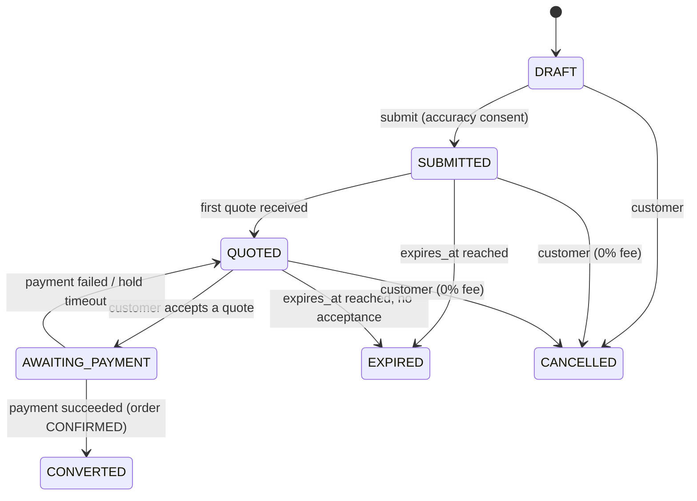
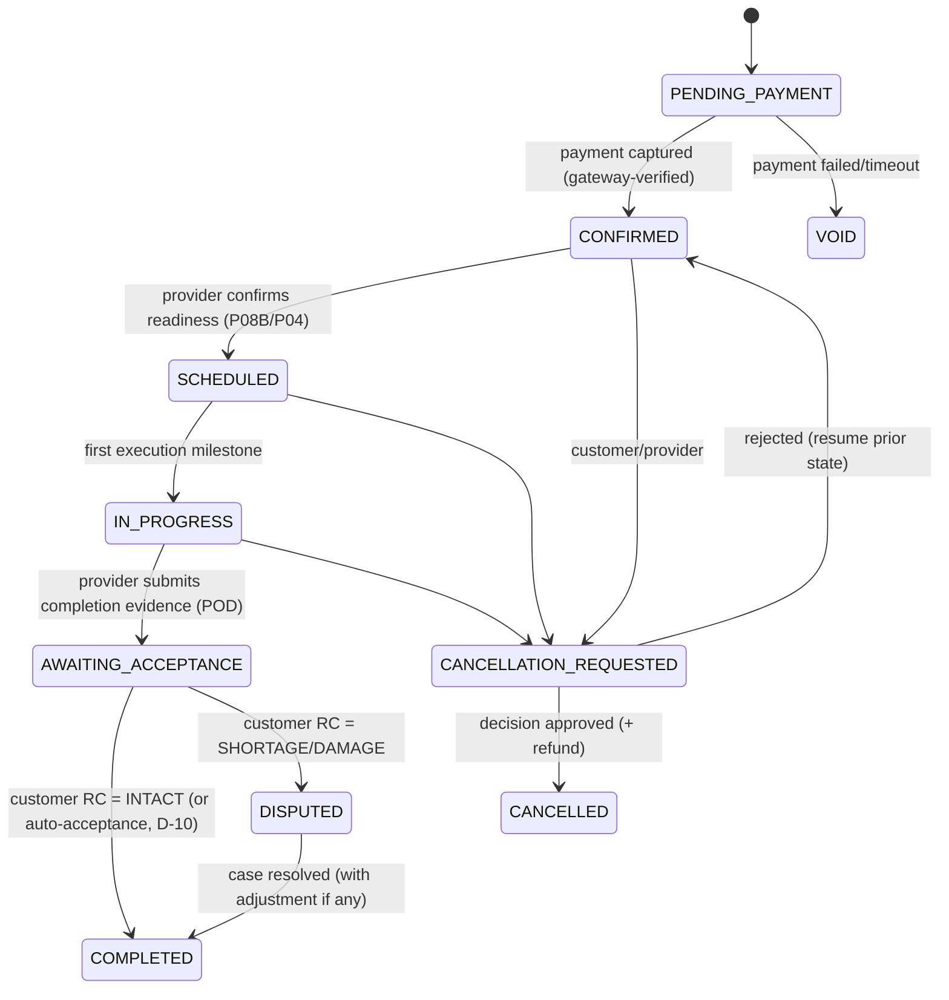
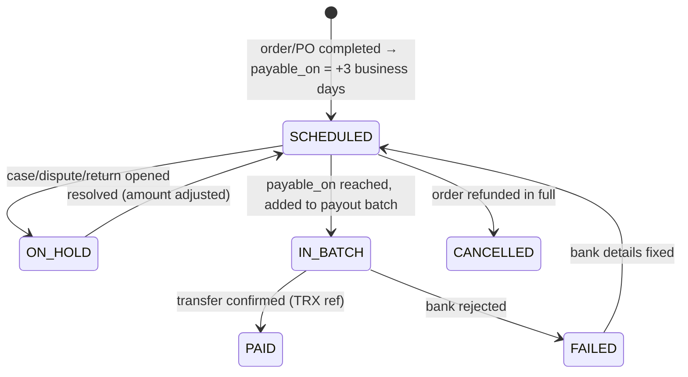

# Backend — State Machines

Every lifecycle is enforced server-side by a transition table (`from`, `event`, `to`, `guard`, `actor`). Invalid transitions return `409 INVALID_STATE_TRANSITION`. Each transition writes an audit row and emits a domain event.

## 1. Service request (`ServiceRequest.status`)

- `SUBMITTED` is the "Q00 waiting" state. Matching providers are notified.
- Default request validity is 7 days, and quote validity is set by the provider (default 48 h). Both are configurable (D-18).
- Draft requests are kept 30 days for resuming, then purged.

## 2. Quote (`Quote.status`)

| From | Event | To | Guard |
|---|---|---|---|
| — | provider submits | `SUBMITTED` | request is `SUBMITTED` or `QUOTED`; provider activity approved; one active quote per provider per request |
| `SUBMITTED` | provider revises | `SUBMITTED` (revision +1) | not accepted; customer is notified of the change |
| `SUBMITTED` | provider withdraws | `WITHDRAWN` | not accepted |
| `SUBMITTED` | `valid_until` passes | `EXPIRED` | — |
| `SUBMITTED` | customer accepts | `ACCEPTED_PENDING_PAYMENT` | quote valid; request not already awaiting payment |
| `ACCEPTED_PENDING_PAYMENT` | payment succeeded | `ACCEPTED` | — |
| `ACCEPTED_PENDING_PAYMENT` | payment failed / 30 min hold timeout | `SUBMITTED` (or `EXPIRED` if past validity) | — |
| `SUBMITTED` | another quote becomes `ACCEPTED`, or the request is cancelled/expired | `NOT_SELECTED` | — |

## 3. Service order (`Order.status`)

- `CANCELLATION_REQUESTED` remembers `resume_status` so a rejected cancellation returns to the exact prior state.
- Warehousing overrides `IN_PROGRESS` with `ACTIVE` (goods in storage) and inserts `CLOSING` (full release plus reconciliation) before `AWAITING_ACCEPTANCE`. See §5.
- Customs uses the release notice as POD, and the customer's "Confirm clearance completion" (CU09) acts as RC.
- `payment_status` and `settlement_status` are tracked separately on the order (see §7 and §8).

## 4. Milestone templates (per service)

Milestones are created from a template when the order is confirmed. Conditional ones are marked `SKIPPED` when not applicable.

| Service / mode | Milestone codes in order |
|---|---|
| Shipping — sea | `BOOKING_CONFIRMED`, `PICKED_UP`*, `DEPARTED`, `IN_TRANSIT`, `ARRIVED`, `CUSTOMS_CLEARANCE`*, `OUT_FOR_DELIVERY`*, `DELIVERED` |
| Shipping — air/express | `BOOKING_CONFIRMED`, `PICKED_UP`*, `DEPARTED`, `ARRIVED`, `CUSTOMS_CLEARANCE`*, `OUT_FOR_DELIVERY`*, `DELIVERED` |
| Shipping — land | `BOOKING_CONFIRMED`, `PICKED_UP`, `DEPARTED`, `BORDER_CROSSING`, `ARRIVED`, `DELIVERED` |
| Transport | `DRIVER_ASSIGNED`, `HEADING_TO_PICKUP`, `ARRIVED_AT_PICKUP`, `CARGO_COLLECTED`, `IN_TRANSIT`, `BORDER_CROSSING`**, `ARRIVED_AT_DROPOFF`, `DELIVERED` |
| Warehousing | `INTAKE_SCHEDULED`, `GOODS_RECEIVED`, `STORED`, (release cycles), `FINAL_RELEASE`, `RECONCILED` |
| Customs | `FILE_REVIEWED`, `AUTHORIZATION_CONFIRMED`, `DECLARATION_SUBMITTED`, `MANIFEST_LINKED`, `INSPECTION_AND_DUTIES`, `RELEASED` |

\* Door-to-door or linked customs only. \** Cross-border only.

## 5. Warehousing extensions

**StorageContract**: `PENDING_INTAKE` → `ACTIVE` (first intake counted) → `CLOSING` (final release requested or term end) → `RECONCILED` (WH07 accepted) → `CLOSED`. Partial releases never leave `ACTIVE`. Closure requires zero remaining stock.

**ReleaseRequest (WH05/WH06)**: `REQUESTED` → `APPROVED` | `REJECTED` → `PICKING` → `READY_FOR_HANDOVER` → `HANDED_OVER` → `COMPLETED`. Guard: requested quantity must be ≤ available (not reserved) quantity. Quantity is reserved when the request is approved.

**IntakeSlot (WH03/PW1)**: `PROPOSED` → `CONFIRMED` → `RECEIVED` | `MISSED` | `RESCHEDULED`.

## 6. Customs extensions

**BrokerAuthorization (CU05/CU06/PC2)**:

| From | Event | To | Actor |
|---|---|---|---|
| — | customer approves in-app | `REQUESTED` | customer (consent recorded; *not yet an active mandate*) |
| `REQUESTED` | official action needed | `PENDING_EXTERNAL_ACTION` | broker/admin |
| `REQUESTED`/`PENDING_EXTERNAL_ACTION` | official reference confirmed | `ACTIVE` | broker (with reference) → optional admin verification (D-08) |
| `ACTIVE` | validity ends | `EXPIRED` | system |
| any non-final | customer/admin revokes | `REVOKED` | customer/admin |
| `REQUESTED` | broker/admin rejects | `REJECTED` | broker/admin |

Guard: broker execution steps that require a mandate (declaration submission) are blocked unless the status is `ACTIVE` (*"Do not perform a step requiring an inactive mandate"*).

## 7. Payment (`PaymentIntent.status`)

`INITIATED` → `PENDING` (3DS / redirect) → `PAID` | `FAILED` | `EXPIRED` | `CANCELLED`. After `PAID`: `PARTIALLY_REFUNDED` → `REFUNDED`.
Only the webhook handler or a server-side verify call may set `PAID`. The client can never set it.

`Order.payment_status` mirrors the latest intent: `UNPAID`, `PAID`, `PARTIALLY_REFUNDED`, `REFUNDED`.

## 8. Settlement (`Settlement.status`)

Marketplace settlements stay `ON_HOLD` until the 3-day return window closes (D-11).

## 9. Document (`Document.status`)

`MISSING` (required placeholder) → `UPLOADED` → `UNDER_REVIEW` → `ACCEPTED` | `CHANGES_REQUESTED` (reason required) → (replace, new version) → `UNDER_REVIEW` …; `ACCEPTED` → `EXPIRED` (when `expiry_date` passes, for licences). The reviewer is the customs broker (order documents) or Logix staff (KYB documents).

## 10. Verification (KYB) (`VerificationCase.status`)

`DRAFT` → `SUBMITTED` → `UNDER_REVIEW` → `APPROVED` | `CHANGES_REQUESTED` | `REJECTED`; `CHANGES_REQUESTED` → `SUBMITTED` (resubmit, A08 "Resubmit"). `APPROVED` sets `OrgWorkspace.status = ACTIVE` and approves the requested activities. A licence expiry later moves the affected activity (or the whole workspace, if it was the CR) to `SUSPENDED` until a valid document is approved.

## 11. Purchase order (`PurchaseOrder.status`)

`PENDING_PAYMENT` → `PLACED` (paid) → `ACCEPTED` (supplier) → `PREPARING` → `READY_FOR_PICKUP` → `HANDED_TO_CARRIER` → `DELIVERED` (carrier POD) → `RECEIVED` (buyer RC intact) → `COMPLETED` (return window closed, or no return possible). Side paths: `RECEIVED_WITH_ISSUE` (RC shortage/damage → case/return), `CANCELLATION_REQUESTED` → `CANCELLED`, and `REJECTED_BY_SUPPLIER` (full refund) from `PLACED`.

## 12. Return request (`ReturnRequest.status`)

`REQUESTED` → `SUPPLIER_REVIEW` → `ACCEPTED` | `INFO_REQUESTED` (→ `SUPPLIER_REVIEW`) | `REJECTED` | `ESCALATED` (admin decides) → `PICKUP_SCHEDULED` → `RETURNED` → `RESOLVED` (`REPLACEMENT_SENT` or `REFUNDED`) → `CLOSED`. Guard on create: within the 3-day window after `RECEIVED`, and quantity ≤ received quantity.

## 13. Cancellation request

`REQUESTED` → `AUTO_APPROVED` (unambiguous rule) | `UNDER_REVIEW` (ambiguous or undefined) → `APPROVED` (fee, refund amount) | `REJECTED` → `REFUND_PROCESSING` → `COMPLETED`. The rule engine is in [modules/13-cancellations-refunds-cases.md](modules/13-cancellations-refunds-cases.md).

## 14. Insurance request and claim

- Request: `REQUESTED` → `UNDER_INSURER_REVIEW` → `QUOTED` → `ACCEPTED` → `PAID` → `ISSUED`; side exits `DECLINED`, `EXPIRED`, `CANCELLED`. **No coverage before `ISSUED`.**
- Claim: `SUBMITTED` → `WITH_INSURER` → `APPROVED` | `REJECTED` → `PAID` (by insurer) → `CLOSED`.

## 15. Case

`OPEN` → `IN_PROGRESS` → `WAITING_ON_CUSTOMER` | `WAITING_ON_PROVIDER` | `WAITING_ON_SUPPLIER` → `IN_PROGRESS` → `RESOLVED` → `CLOSED` (auto after 7 days). `RESOLVED` → `REOPENED` within 7 days.

## 16. Org workspace and product listing

- OrgWorkspace: `PENDING_VERIFICATION` → `ACTIVE` ↔ `SUSPENDED`; `PENDING_VERIFICATION` → `REJECTED`.
- Product: `DRAFT` → `PUBLISHED` ↔ `PAUSED`; `PUBLISHED` → `OUT_OF_STOCK` (auto when stock < MOQ) → `PUBLISHED` (restock); any → `REMOVED` (admin moderation, reason required). An optional `PENDING_REVIEW` step is added before `PUBLISHED` if pre-moderation is enabled (feature flag).
