# Backend — Execution Plan

How we actually build the backend, given the plan in this folder **and** the state of the mobile app mockup ([logic-app](../../../logic-app/), Flutter).

- Inputs: [00-overview](00-overview.md), [02-architecture](02-architecture.md), [05-api-conventions](05-api-conventions.md), [09-open-decisions](09-open-decisions.md), [10-roadmap](10-roadmap.md), [11-database-schema](11-database-schema.md), [app screen inventory](../../app/md/06-screen-inventory.md), and the app code (`logic-app/lib`, `logic-app/docs/PLAN.md`).
- The roadmap ([10-roadmap](10-roadmap.md)) stays the source for **what** is built per phase. This document sets the **order, slices, contracts with the app and definition of done**.
- Sizing assumes the roadmap's team (3 backend engineers). With fewer people the order holds and the weeks stretch.

---

## 1. What the mockup app changes

The app is a clickable Flutter build of the 84-screen Arabic kit: every kit screen exists, runs on hard-coded sample data (`features/**/data/*.dart`), and has `TODO(auth)`-style markers where a repo/cubit must be connected. Its only API call is `logout`. That changes the plan in these ways:

| # | Topic | Plan assumed | Reality | Consequence |
|---|---|---|---|---|
| C1 | Mobile framework (T-01) | React Native + shared TS packages | **Flutter** (Dart, Cubit, Retrofit/Dio, go_router) | Close T-01 as Flutter. `packages/validation`, `api-client`, `i18n` serve only backend + dashboard |
| C2 | API client for the app | Generated TS client | Hand-written Retrofit + json_serializable | The **OpenAPI spec is the contract**. Generate the Dart client with [`swagger_parser`](https://pub.dev/packages/swagger_parser) (outputs Retrofit + json_serializable, the app's existing stack) |
| C3 | Screen IDs | V2 IDs canonical | App uses kit IDs (A01, L01, Q01, P06…) | No backend impact (endpoints are resource-named). Tickets reference both: `TR02 / K-L01` |
| C4 | Role names | `CUSTOMER / SUPPLIER / PROVIDER / DRIVER` | `buyer / supplier / provider`, no driver | App maps `buyer ↔ CUSTOMER`. API keeps plan enums |
| C5 | Sign-up order | OTP first, then choose role and create account | Choose role → fill register form → OTP | No backend change: the app holds the form, calls `otp/request` → `otp/verify` → `POST /organizations`. Returning users: `otp/verify` returns `isNewUser=false` + workspaces |
| C6 | Error body | `{ error: { code, message, details[] } }` | App parses Laravel shape `{ message, errors{field:[…]} }` | Backend keeps the planned envelope. App updates `ApiErrorModel` (read `error.code`, map `details[].field`) |
| C7 | Tokens | 15-min access + rotating refresh | App stores one token; any 401 clears the session | App adds a refresh interceptor (`TOKEN_EXPIRED` → `/auth/refresh` → retry once) |
| C8 | Headers | `X-Organization-Id`, `X-Workspace`, `Idempotency-Key`, `X-App-Version`, `X-Platform` | App sends `Authorization`, `Accept-Language`, `X-localization` | App interceptor adds the planned headers. Backend ignores `X-localization` |
| C9 | Fake backend | Allow-listed test numbers with a fixed OTP in non-prod | App planned `FakeAuthRepo` with OTP `123456` | Use **`123456` as the non-prod test code**. The app skips fake repos and talks to `dev` directly |
| C10 | Money | `{ amount (halalas), currency, formatted }` | Sample prices are strings (`'2,760'`) | App models use the Money object. `formatted` covers display until the app formats itself |
| C11 | Admin dashboard | Built in parallel from Phase 1 | Not started | KYB approval, feature flags and ops actions need a **stopgap**: admin endpoints usable from Swagger + seed/CLI scripts until the dashboard catches up (see §6) |
| C12 | App scope gaps | 110 V2 screens | Missing: driver mode, insurance, warehouse execution (WH03–WH07), broker authorization (CU05–CU06), returns (M10/M11, SR1/SR2), additional charges, sessions list, workspace switcher, drafts | Backend still builds them per roadmap. They go to the **app backlog** (§7) |

**Repository layout.** The backend lives in this repo at `apps/backend` (with `apps/dashboard` later), per [planning/README §6](../../README.md#6-proposed-repository-layout). The Flutter app stays in its own repo (`logic-app`). CI in this repo publishes `openapi.json` on every merge to `main`, and the app regenerates its client from it.

---

## 2. Decisions to close (and what we do until they close)

Work starts now. No slice waits on a decision; each blocked item gets an adapter or config seam.

| ID | Needed by | Until decided we… |
|---|---|---|
| T-01 Mobile framework | Now | **Close as Flutter** (C1) |
| T-02 ORM, T-08 monorepo | Week 1 | Proceed with Prisma + pnpm/Turborepo (plan defaults) |
| D-23 / T-03 Hosting region and cloud | Staging (week 4) | Run `local` + a `dev` env on any cloud with synthetic data only. No real personal data before sign-off |
| T-04 SMS provider + sender ID | Slice 1 prod readiness | `FakeSmsAdapter` (logs to Mailpit/console) + allow-listed numbers. **Apply for the sender ID now** (weeks of lead time) |
| D-05 Payment gateway | Slice 4 | `FakeGatewayAdapter` with a simulated 3DS page and webhooks (success / fail / timeout). **Start merchant onboarding now** |
| D-04 Funds flow | Slice 4 (real money) | Ledger accounts designed for both split and principal models |
| D-03 Merchant of record / invoicing | Phase 2 invoicing | Build ledger and settlements; keep invoice issuing behind a flag |
| D-02 Commission and tax base | Slice 3 (quote preview) | Recommended default in `commission_rules` config |
| D-16 Pre-award visibility, D-17 customer verification, D-18 validity rules, D-19 multi-user | Slices 2–3 | Implement the recommendations as config/policy, record them as ADRs |
| D-25 Launch scope | Slice 6 | Build all four services; transport first (the app's most complete flow) |

---

## 3. Delivery approach: vertical slices

Every slice goes **database → API → OpenAPI → Flutter screens wired → demo**. A slice is done when the listed app screens run on the `dev` API with seeded data (§5).

Transport goes first because the app's transport flow is the most complete end to end (K-L01–L04 → Q00–Q03 → B01–B05 → O02 → T01–T04) and D-25 recommends launching with it.

```mermaid
gantt
  dateFormat  X
  axisFormat  W%s
  section Phase 0
  S0 Foundations            :s0, 0, 3
  section Phase 1
  S1 Auth and sessions      :s1, 3, 5
  S2 Orgs, KYB, files       :s2, 5, 7
  S3 Transport request+quotes :s3, 6, 9
  S4 Accept, pay, order     :s4, 9, 11
  S5 Notifications and chat :s5, 8, 11
  S6 Shipping, customs, warehousing requests :s6, 11, 13
  section Phase 2
  S7-S12 Execution, finance, cancellations :p2, 13, 23
  section Phase 3
  S13-S14 Marketplace and supplier :p3, 23, 31
```

### S0 — Foundations (weeks 1–3) · roadmap B0.1–B0.6

| Task | Notes |
|---|---|
| Monorepo | `pnpm` + Turborepo, `apps/backend`, `packages/config`. Commit hooks, CODEOWNERS |
| NestJS 11 skeleton | Fastify adapter, `api` and `worker` entrypoints from one image, zod-validated config |
| Local stack | Docker Compose: Postgres 16 + PostGIS, Redis 7, MinIO, Mailpit, ClamAV, fake SMS sink |
| Schema bootstrap | The `dev` database, roles and extensions already exist on the server ([SERVER-DETAILS §8](../../SERVER-DETAILS.md)); migrations skip `CREATE ROLE`/`CREATE EXTENSION` and only create schemas, objects and grants. [11-database-schema](11-database-schema.md) is the source of truth. Split it into ordered **SQL migrations**, apply, then `prisma db pull` to generate the Prisma schema (multi-schema). Triggers, partitions, `EXCLUDE`/`CHECK`, partial indexes stay in SQL ([§25](11-database-schema.md#25-prisma-mapping-notes)). CI runs `prisma migrate diff` to catch drift |
| Common layer | Error envelope + stable error codes, i18n (ar/en), Money type, Riyadh business-day calendar, reference generator (`LX-`, `PO-`…), cursor pagination, idempotency interceptor, request ID |
| Events and jobs | Outbox + relay, BullMQ queues, `processed_events`, audit log |
| Observability | pino, OpenTelemetry, Sentry, `/health/live` and `/health/ready` |
| Reference data | Seeds (cities, ports, checkpoints, vehicle/container/storage types, document types, product categories, terms v1) + read APIs with ETag |
| `GET /app-config` | Min app version, feature flags, support contacts |
| CI | Lint, typecheck, unit, integration (Testcontainers), OpenAPI export + breaking-change diff, gitleaks. Deploy `dev` on merge |
| **Contract spike** | Generate the Dart client with `swagger_parser` from the exported spec and call `/app-config` + one reference endpoint from the Flutter app |

**Exit:** `dev` is live with seeded reference data, and the Flutter app fetches `/app-config` from it.

### S1 — Auth and sessions (weeks 3–5) · B1.1, part of B1.2

- **Backend:** `POST /auth/otp/request|verify`, `/auth/refresh` (rotation + reuse detection), `/auth/logout`, `GET/PATCH /me`, `GET /me/workspaces`, `POST /organizations` (individual/company + first workspace), `GET /terms/current`, `POST /consents`, `POST /devices/push-token`. Rate limits per [05 §13](05-api-conventions.md#13-rate-limits-defaults). Test numbers with code `123456` in non-prod.
- **App screens wired:** splash (restore session → home of saved workspace), A01 welcome, A02 choose role, A05 register (individual/company), A04 OTP (resend countdown from `resendAvailableAt`), login, logout, settings (language → `PATCH /me`).
- **App changes needed:** `AuthRepo`, `SessionCubit`, router redirect, refresh interceptor (C7), new headers (C8), `ApiErrorModel` (C6), role mapping (C4).

### S2 — Organizations, KYB and files (weeks 5–7) · B1.2–B1.4

- **Backend:** business profile, provider activities + service areas, licences, bank accounts (IBAN validation, encrypted), document requirements, files (`upload-url` → PUT to S3 → `complete` → ClamAV job), verification case submit/status, CASL policies + org-context and workspace guards. **Admin stopgap:** `/admin/kyb/*` review endpoints + staff login with TOTP, usable from Swagger.
- **App screens wired:** provider verification K-P01–K-P04 (business registration, licences + IBAN, terms, status), supplier approval (S07), account → business profile, bank account, addresses, edit profile. The app's `UploadDropzone` gets a real file picker.

### S3 — Transport request, matching and quotes (weeks 6–9) · B1.5–B1.7 (transport only)

- **Backend:** service-request drafts (`POST`, `PATCH ?step=`, `submit`) for **TRANSPORT**, request expiry, matching (broadcast to approved `TRANSPORT_*` activities in the service area, D-18), provider opportunities feed with pre-award masking (D-16), clarification Q&A, quote preview (commission, D-02), submit/revise/withdraw, quote expiry jobs, customer quotes list with `sort=price|eta|rating`, compare, and a maps proxy for geocoding and route estimate (key stays server-side).
- **App screens wired:** buyer choose service (H02), K-L01 route, K-L02 vehicle and cargo, K-L03 schedule, K-L04 review, Q00 waiting, Q01 offers (sort tabs), Q02 compare, Q03 offer details, E04 expired, provider profile. Provider side: K-P05 home counters, K-P06 available requests, K-P07 opportunity, K-P08 quote, K-P08B my offers.

### S4 — Accept, pay and order (weeks 9–11) · B1.8–B1.9

- **Backend:** `POST /quotes/{id}/accept` (Redis lock + idempotency), payment intents, gateway adapter (fake → real after D-05), webhooks with server-to-server verify, order creation on `payment.succeeded`, `GET /orders/feed`, `GET /orders/{id}` with `allowedActions`, `GET /orders/by-reference/{ref}`, provider confirm readiness.
- **App screens wired:** B01 review booking, B02 payment method (3DS WebView), B03 confirmed, B05 payment failed, O02 order details, my orders tab, buyer home recent activity and stats, provider "operations" list.
- **Milestone M1 (week 11):** internal demo on real devices. Buyer requests transport → provider quotes → buyer compares, pays (sandbox) → both sides see the order.

### S5 — Notifications and messaging (weeks 8–11, parallel) · B1.10–B1.11

- **Backend:** notification center, templates (ar/en), FCM push, SMS templates, Socket.IO `/rt` with room authorization, conversations (pre-award and order) with contact masking and attachments.
- **App screens wired:** notifications (bell), messages tab, chat. App sets up Firebase (FCM) and handles deep links.

### S6 — Remaining request types (weeks 11–13) · rest of B1.5–B1.7

- **Backend:** request details, per-step validation and matching for **SHIPPING** (sea/air/land/LCL, D-13), **CUSTOMS**, **WAREHOUSING**. The quote, pay and order machinery from S3–S4 is reused unchanged.
- **App screens wired:** K-F01–F07 international, K-D01–D04 customs (document vault uses S2 files), K-W01–W02 storage.
- **Phase 1 exit:** any service can be requested, quoted, paid and seen as an order; staff can verify businesses (via the admin stopgap or dashboard).

### Phase 2 slices (weeks 13–23) · roadmap B2.x

Ordered by what unblocks the app's existing screens first:

| Slice | Roadmap | App screens it lights up | Notes |
|---|---|---|---|
| S7 Milestones and tracking | B2.2–B2.4 | T01 tracking, K-P09 execute shipment, customs progress (D04) | GPS ingest needs **driver mode, which the app lacks** (§7). Until then the provider records milestones |
| S8 POD, receipt, rating | B2.7 | T02 confirm receipt, T03 rate, R01 report issue, R02 claim status | D-10 auto-acceptance behind config |
| S9 Documents v2 | B2.1 | D02 vault statuses, D03 correct document, order documents | |
| S10 Ledger, settlements, payouts | B2.8–B2.9 | K-P11 provider settlement, supplier receivables | Needs D-04 for real money movement |
| S11 Cancellations, refunds, cases | B2.11–B2.13 | Cancel order + policy, claim status | D-01/D-14: engine returns `REQUIRES_REVIEW` until signed off |
| S12 Invoicing, service execution, insurance | B2.3, B2.5, B2.6, B2.10, B2.14 | T04 invoice | Invoicing blocked on D-03. Warehouse/customs execution and insurance have **no app screens yet** |

**Milestone M2 (≈ week 21):** closed pilot, transport + shipping with selected providers.

### Phase 3 slices (weeks 23–31) · roadmap B3.x

- **S13 Catalog, search, cart, checkout:** app screens M01 market, product details, supplier profile, compare suppliers, cart, checkout, purchase confirmed, purchase order.
- **S14 Supplier fulfilment, returns, settlements:** app screens S01 home, S02 inventory, S03/S03B new product, S04 orders, S05 prepare order, S06 settlement. Returns need new app screens (§7).

Phase 4 (integrations: Fasah, Wathq, national address, insurers, automated payouts) follows the roadmap unchanged and depends on approvals.

---

## 4. The app ↔ API contract

1. **OpenAPI 3.1 is the contract.** Exported by CI on every merge to `main`, with a breaking-change diff that fails the PR unless the change is flagged.
2. **The app regenerates** its Retrofit client and models with `swagger_parser`. Generated code goes under `lib/core/networking/generated/`. Repos wrap it with `safeApiCall` as today.
3. **Enums are codes.** The app translates them in its ARB files and must render unknown values with a generic label ([05 §12](05-api-conventions.md#12-versioning-and-compatibility)).
4. **Error codes are a published list** (`VALIDATION_FAILED`, `QUOTE_EXPIRED`, `WORKSPACE_NOT_ACTIVE`…). The app maps them to its error screens and snackbars.
5. **Buttons come from `allowedActions`.** App screens stop hard-coding which actions show for a status.
6. **Sample data is replaced, not kept.** Each wired screen deletes its `data/*.dart` sample and gets a demo account in the seed instead.

---

## 5. Definition of done (per slice)

- [ ] Migrations applied in `dev`. No Prisma drift.
- [ ] Endpoints documented in OpenAPI with examples in both languages.
- [ ] Unit tests for domain rules and state transitions; integration tests (Testcontainers) for each endpoint, covering authorization (another org's resource returns 404).
- [ ] Error codes and server messages in ar and en.
- [ ] Seed data covers the slice's demo journey (demo accounts per role).
- [ ] The listed Flutter screens run against `dev` on a phone in Arabic and English, with loading, empty and error states.
- [ ] Events, jobs and notifications for the slice are wired and idempotent.
- [ ] Audit log entries for state changes and money actions.

---

## 6. Admin dashboard dependency

Phase 1 needs staff actions (approve KYB, manage reference data, flip feature flags, look at zero-quote requests). The dashboard track has not started, so:

- **Weeks 5–11:** admin API endpoints ship with their slice and are used through Swagger with a staff login + TOTP, plus scripts for bulk seeding.
- **From week 8:** start the dashboard (Next.js, [web_dashboard plan](../../web_dashboard/md/00-overview.md)) with the KYB queue first, then the order monitor and configuration. It consumes the same OpenAPI via the generated TS client.

---

## 7. App backlog created by this plan

The backend covers these, but the app has no screens (or no logic) for them. Hand them to the app track:

| Area | Screens (V2 / gap IDs) | Needed by |
|---|---|---|
| Plumbing | Refresh interceptor, headers, error model, role mapping, generated client, Firebase setup | S1 |
| Platform fixes | Android `INTERNET` permission in release, core library desugaring, iOS permission strings, `USE_FAKE_API` default `false` | S1 |
| Workspace switcher, sessions list | G20, X06 | S1–S2 |
| Drafts list | G01 | S3 |
| Fleet, drivers, service areas | G06–G08 (fleet screen exists as UI only) | S7 |
| **Driver mode** | G23, PT2, PT3, background GPS, POD | S7 |
| Additional charge approval | G21 | S11 |
| Warehouse execution | WH03–WH07, PW1–PW3 | S12 |
| Customs broker authorization | CU05, CU06, PC1–PC3 | S12 |
| Insurance | IN1–IN4 | S12 |
| Marketplace returns | M10, M11, SR1, SR2 | S14 |

---

## 8. Risks specific to this plan

| Risk | Mitigation |
|---|---|
| Dart client generation doesn't fit the spec (unions, `oneOf` details) | Contract spike in S0. Keep request detail schemas flat per service; fall back to hand-written Retrofit for the few endpoints that don't generate cleanly |
| App and backend drift | OpenAPI diff in CI + the app regenerates on each backend release; each slice's DoD includes the app screens |
| Staff actions without a dashboard | Admin stopgap (§6) and an early start on the dashboard's KYB page |
| Sender ID / gateway onboarding delays | Start both in week 1; fake adapters keep development moving |
| Hosting region undecided (D-23) | `dev` holds synthetic data only; no production data until sign-off |
| App gaps (driver, insurance, returns) delay Phase 2–3 pilots | Hand the §7 backlog to the app track now, with the matching V2 module docs |

---

## 9. First two weeks

1. Record T-01 = Flutter and T-02/T-08 = plan defaults as ADRs; update [09-open-decisions](09-open-decisions.md).
2. Start the SMS sender ID application and payment gateway merchant onboarding (shortlist in D-05).
3. Scaffold `apps/backend` (NestJS 11 + Fastify), the Docker Compose stack and CI.
4. Convert [11-database-schema](11-database-schema.md) into ordered SQL migrations, apply locally, generate the Prisma schema.
5. Build the common layer (errors, i18n, money, pagination, idempotency, outbox).
6. Seed reference data; ship `GET /app-config` and reference endpoints to `dev`.
7. Run the Dart client generation spike against the Flutter app.
8. Send the §7 backlog and the platform fixes to the app team.
