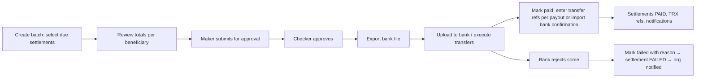

# Dashboard Module 06 — Finance (D24–D30)

Backend: [payments-finance](../../../backend/md/modules/12-payments-finance.md), [cancellations-refunds-cases](../../../backend/md/modules/13-cancellations-refunds-cases.md). Several screens depend on **D-02, D-03, D-04** (commission base, invoicing model, funds flow). The UI is built to show whichever model is configured.

## D24 — Payments
- **List columns:** payment ID, gateway ref, payable (LX-/PO-/extra charge/premium) link, payer org, method (mada/card/Apple Pay…), amount, status, created, captured, refunds (sum), reconciliation status (matched to the gateway settlement report: ✓ / pending / mismatch).
- **Filters:** status, method, date, amount range, reconciliation status.
- **Detail:** timeline (initiated → pending → paid/failed), raw gateway events (webhooks, masked), verify-call results, linked order/PO, refunds, ledger entries.
- **Actions:** `Re-verify with gateway` (safe, idempotent), `Mark as investigated` (for mismatches, with a note). No manual "mark paid" exists: payment truth comes from the gateway only.
- **Queue:** `PENDING` > 10 min, webhook/verify mismatches.

## D25 — Refunds
- **List columns:** refund ID, payment, order/PO, amount, reason (cancellation/return/dispute/supplier rejection), case link, requested by, approved by, status, gateway refund ref, created/completed.
- **Create refund** (from a case, cancellation or order): amount (≤ refundable, shown), reason, internal note. Above the threshold → maker-checker (D-W05).
- **Failure handling:** `FAILED` → options: retry, switch to a manual bank refund (capture the customer IBAN via a support flow; mark completed with the bank reference).
- Every refund shows its ledger reversal and credit note (per D-03).

## D26 — Settlements
- **List columns:** STL reference, beneficiary org, source (order/PO), service/category, completed at, payable on (T+3 business days), gross, commission, commission VAT, adjustments, net, status (Scheduled / On hold / In batch / Paid / Failed / Cancelled), hold reason.
- **Filters:** status, payable on ≤ date, beneficiary, category, has hold.
- **Detail:** calculation breakdown (with the commission rule version used), adjustments (refunds, damages, returns) with links, hold history, payout link, statement PDF.
- **Actions:** place hold (reason), release hold (reason), recalculate (only if an adjustment was added; shows a diff), view statement.

## D27 — Payout batches
**Flow (MVP manual banking):**

- Batch detail: beneficiaries, IBAN (masked; the export contains full values and the export action is audited), amounts, settlement lines, status per payout.
- Bank file formats: pluggable exporters per bank (CSV templates), chosen per batch.
- Guards: only `VERIFIED` bank accounts, no beneficiary with an active hold, bank account changed < 48 h excluded (anti-fraud), and the maker ≠ checker.
- PAY2 in the app shows *Transfer reference TRX-2048*. The TRX ref is generated per payout at batch creation and communicated to the bank as the payment reference where supported.

## D28 — Invoices and credit notes
- **List columns:** number, type (service invoice on behalf of the provider / commission invoice / credit note / Logix invoice (principal model)), issuer, recipient, order/PO, date, subtotal, VAT, total, ZATCA status (cleared/reported/pending/rejected with warnings), PDF.
- **Actions:** view PDF, resend to the recipient, retry ZATCA submission, issue a credit note (from a refund or adjustment only, never free-form without maker-checker).
- Numbering is gap-free per issuer. Voiding is not allowed; corrections use credit notes.

## D29 — Commission rules
- **Table:** category (Freight & transport / Customs & storage / Marketplace), rate, VAT on commission (yes/no), base definition (text), effective from/to, status (active/scheduled/expired), created by, approved by.
- **Create new version:** rate, VAT flag, effective from (future or now), justification → maker-checker. Old versions remain for historical orders (rate snapshots).
- A banner warns that changes affect **new** orders only.

## D30 — Ledger and reconciliation
- **Account balances:** gateway clearing, customer payments held, provider/supplier payables (total + per org), commission revenue, VAT output payable, refunds payable, payouts in transit.
- **Daily reconciliation report:** gateway settlement file vs `gateway_clearing` entries (matched, missing, extra, amount mismatch) with drill-down.
- **Invariants panel:** Σ debits = Σ credits (✓), payable balances = Σ unpaid settlements (✓/✗).
- **Manual adjustment** (rare): a balanced journal with reason and attachments, maker-checker.
- **Exports:** journal entries (period), VAT report (commission VAT; service VAT if principal), commission report per category, payables aging.

## Acceptance criteria
- [ ] No UI path can set a payment as paid, and gateway truth is always displayed.
- [ ] Payout batches enforce guards and maker-checker, and exports are audit-logged.
- [ ] Settlement calculations show the rule version and match the backend fixtures.
- [ ] Daily reconciliation surfaces mismatches with drill-down, and invariants are green on healthy data.
- [ ] Commission changes apply only to orders created after the effective time.
